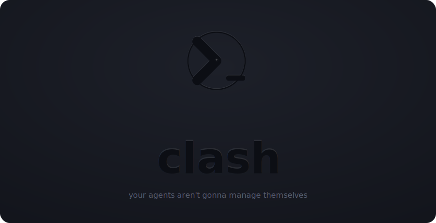

<p align="center">
  
</p>

<p align="center">
  <strong>Terminal UI for Claude Code Sessions & Agent Teams</strong>
</p>

<p align="center">
  <a href="#installation">Install</a> &bull;
  <a href="#features">Features</a> &bull;
  <a href="#usage">Usage</a> &bull;
  <a href="#keybindings">Keys</a>
</p>

---

## Features

- **Session management** — list, attach, detach, create, stash, and delete Claude Code sessions
- **Inline terminal** — attach to sessions with a full vt100 terminal emulator, no window switching
- **Real-time status** — instant status detection via hooks, daemon PTY screen analysis, and JSONL parsing (three-layer system)
- **Animated status icons** — active sessions show animated spinners and pulsing icons for visual feedback
- **In-process daemon** — embedded PTY daemon manages sessions without a separate process
- **Git worktree support** — spawn sessions in isolated worktrees for parallel feature branches (`w` key)
- **Repo config discovery** — auto-detects MCP servers, custom commands, agent definitions, and setup scripts from the project directory
- **Teams & tasks** — create, view, and delete teams; organize agents, manage tasks, send messages
- **Subagent tracking** — view subagent trees per session, expand/collapse in the sessions table
- **Keyboard-driven** — vim-style navigation, command mode (`:`), fuzzy filter (`/`), context help (`?`)
- **UI state persistence** — restores navigation, selection, filters, and expanded sessions on restart
- **Single-instance lock** — prevents multiple clash instances from running simultaneously
- **Guided tour** — first-launch walkthrough, replay anytime with `:tour`
- **Debug mode** — `clash --debug` enables verbose logging with a header indicator
- **Self-updating** — `:update` in the TUI or `clash update` from the CLI

## Installation

### Quick install (Linux / macOS)

```bash
curl -fsSL https://raw.githubusercontent.com/defgenx/clash/main/install.sh | bash
```

Custom install path:

```bash
CLASH_INSTALL_DIR=~/.local/bin curl -fsSL https://raw.githubusercontent.com/defgenx/clash/main/install.sh | bash
```

### Build from source

```bash
cargo install --git https://github.com/defgenx/clash.git
```

### Requirements

- Rust 1.75+ (for building from source)
- Claude Code CLI (`claude`)

## Usage

```bash
clash                              # Start (reads from ~/.claude)
clash --data-dir ~/.claude         # Custom data directory
clash --claude-bin /path/to/claude # Custom CLI path
clash --debug                      # Enable debug logging
clash update                       # Update to the latest release
```

On first launch, clash installs lifecycle hooks into `~/.claude/settings.local.json` for instant status detection and shows a guided tour. Replay it anytime with `:tour`.

### Session Status

clash detects session status through three layers (in priority order):

1. **Hooks** — Claude Code lifecycle events (`PermissionRequest`, `Stop`, `SessionStart`, etc.) write instant status updates
2. **Daemon PTY** — screen content analysis pattern-matches the terminal for prompts, approval dialogs, and thinking indicators
3. **JSONL baseline** — conversation log heuristics (last entry type, stop reasons, timing)

| Icon | Status | Meaning |
|------|--------|---------|
| `◆◇` | Prompting | Claude needs tool approval — blinking diamond |
| `◉` | Waiting | Awaiting your next prompt |
| `◌◎◉` | Thinking | Reasoning / generating — pulsing circle |
| `⠋⠙⠹…` | Running | Executing tools — braille spinner |
| `○◔◑◕●` | Starting | Session just spawned — filling circle |
| `✗` | Errored | Session crashed shortly after starting |
| `○` | Idle | Exited or inactive |

## Keybindings

### Navigation

| Key | Action |
|-----|--------|
| `j` / `k` | Select next / previous |
| `g` / `G` | Jump to first / last |
| `Enter` | Drill in |
| `Esc` | Go back |
| `q` | Quit (with confirmation) |

### Modes

| Key | Description |
|-----|-------------|
| `:` | Command mode — `:teams`, `:sessions`, `:tour`, `:update`, `:quit` |
| `/` | Fuzzy filter |
| `?` | Context help |

### Sessions

| Key | Action |
|-----|--------|
| `a` | Attach (inline terminal) |
| `o` | Open in new pane / tab / window |
| `O` | Open ALL running sessions (smart layout) |
| `c` / `n` | New session (two-step: directory, then name) |
| `s` | Stash / unstash session (stop process, keep in registry) |
| `w` | Spawn session in a git worktree |
| `Tab` | Expand / collapse subagents |
| `A` | Toggle active / all |
| `d` | Drop session |
| `D` | Drop ALL sessions |
| `i` | Inspect (drill into detail) |

### Teams

| Key | Action |
|-----|--------|
| `c` | Create team |
| `d` | Delete team |
| `Enter` | View team detail |

### Attached Mode

| Key | Action |
|-----|--------|
| `Ctrl+B` | Detach (works across all terminal encodings) |
| Everything else | Forwarded to Claude |

### Session Detail

| Key | Action |
|-----|--------|
| `s` | Subagents |
| `t` | Linked team |
| `m` | Team members |
| `a` | Attach |
| `d` | Drop |

### Team Detail

| Key | Action |
|-----|--------|
| `Enter` / `a` | View agents |
| `t` | View tasks |
| `s` | View lead session |
| `d` | Delete team |

### Commands

| Command | Action |
|---------|--------|
| `:teams` | Navigate to Teams view |
| `:sessions` | Navigate to Sessions view |
| `:subagents` | Navigate to Subagents view |
| `:create team <name>` | Create a new team |
| `:delete team <name>` | Delete a team |
| `:create task <team> <subject>` | Create a task |
| `:new [path]` | Spawn a new session |
| `:active` / `:all` | Filter sessions |
| `:tour` | Replay guided tour |
| `:update` | Update clash |
| `:quit` | Exit |

## Data

clash reads directly from Claude Code's filesystem:

```
~/.claude/
├── projects/{name}/
│   ├── sessions-index.json            # Session index with summaries
│   ├── {session-id}.jsonl             # Conversation log
│   └── {session-id}/subagents/        # Subagent transcripts
├── teams/{name}/config.json           # Team config + members
├── tasks/{team-name}/{id}.json        # Tasks
└── settings.local.json                # Hook registrations (written by clash)
```

clash also maintains its own state in `~/.claude/clash/`:

```
~/.claude/clash/
├── hooks/status-hook.sh               # Lifecycle hook script
├── status/{session-id}                # Instant status from hooks
├── names/{session-id}                 # Session display names
├── project-names/{encoded-cwd}        # Project-to-name mapping
├── sessions.json                      # Session registry
├── ui_state.json                      # Persisted UI state (nav, selection, filters)
└── trusted_repos.json                 # SHA256 trust store for repo setup scripts
```

Single-instance lock file: `~/.local/share/clash/clash.lock`

## Architecture

clash follows **The Elm Architecture** (TEA) with clean architecture layers:

```
User Input → Action → reducer() → (State', Effects) → execute_effects() → draw()
                        (pure)                          (infrastructure IO)
```

| Layer | Purpose |
|-------|---------|
| **Domain** | Entities, port traits — no dependencies |
| **Application** | State, actions, effects, pure reducer |
| **Adapters** | Input mapping, view rendering |
| **Infrastructure** | Event loop, filesystem, daemon, CLI, TUI widgets |

## Development

```bash
cargo test          # Run all tests
cargo clippy        # Lint
cargo fmt --check   # Check formatting
```

Releases are automatic — push with conventional commits (`feat:`, `fix:`) and CI handles the rest.

## License

MIT
