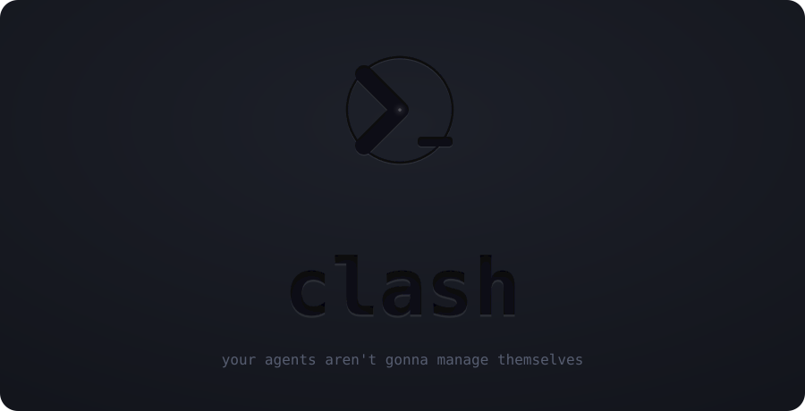

<p align="center">
  
</p>

<p align="center">
  <strong>GUI & Terminal UI for Claude Code Sessions, Agent Teams & Dev Workflows</strong>
</p>

<p align="center">
  The <a href="#gui-primary-mode">GUI</a> is the primary way to use clash;
  the TUI is the terminal-native fallback mode.
</p>

<p align="center">
  <a href="#installation">Install</a> &bull;
  <a href="#features">Features</a> &bull;
  <a href="#usage">Usage</a> &bull;
  <a href="#keybindings">Keys</a>
</p>

---

## Features

- **Session management** — list, attach, detach, create, stash, and delete Claude Code sessions
- **Inline terminal** — attach to sessions with a full terminal passthrough, status bar showing session name / project / branch
- **Real-time status** — instant status detection via hooks, daemon PTY screen analysis, and JSONL parsing (three-layer system)
- **Animated status icons** — active sessions show animated spinners and pulsing icons for visual feedback
- **Section-based layout** — sessions are grouped into Active (working), Done (idle/stashed), Fail (errored), and External (wild claude processes started outside clash, kept at the bottom so they don't interleave with clash-managed rows) with stable alphabetical ordering; press `A` to cycle section filter
- **In-process daemon** — embedded PTY daemon manages sessions without a separate process
- **Git worktree support** — spawn sessions in isolated worktrees for parallel feature branches (`w` key); worktree column shows `⊟ project/worktree` for project context
- **Repo config discovery** — auto-detects MCP servers, custom commands, agent definitions, and setup scripts from the project directory
- **Teams & tasks** — create, rename, configure, and delete teams; manage members (agent type, model, prompt, rename) and see at a glance who's running; full task management (create, cycle status, assign owner, delete); per-agent inboxes. In the GUI, jump straight from a running member to its live session.
- **Scratches** — keep free-form text notes inside clash (`:scratch`), organized in an IntelliJ-style **"Scratches and Consoles"** tree: create notes and nested folders, rename, delete, and reorganize (move via a folder picker in the TUI, drag-and-drop in the GUI). Each note is a plain file under `~/.claude/clash/scratch/` by default — set `scratch_dir` in `config.toml` (or the GUI **Scratch directory** setting) to store them anywhere. Opening a scratch shows an editor picker: terminal editors (vim/emacs/nano…) open in a tab/pane, GUI editors (VS Code/Cursor/Zed…) launch alongside, like opening a project
- **Workflows (GUI)** — manage a full plan → plan-review → implement → diff-review → (optional) PR pipeline per feature: launch a planning agent, read the plan, approve or request changes, **annotate the diff with line-level comments** the agent addresses on the next round, then approve straight to done or — if you use PRs — track the draft PR and **mark it ready** once validated — with a full **revision timeline** (every round's note, plan diff, frozen plan and code diff), decision notifications, and a kanban board. Multi-repo work is first-class: **link the PRs from the other repos** to one item and open/track them all together, with a **PR dashboard** across every project. Any item can be **shared or exported** (clipboard, `.md`/`.html` file, Slack/Discord webhook) with a preview of exactly what leaves the machine. Start end-to-end, **from a plan you already have**, or **review-only from an existing PR or branch**. See [Workflows](#workflows-gui)
- **Queued follow-ups** — type the next instruction while an agent is still working (`f` in the TUI, *Queue follow-up…* in the GUI) and clash delivers it to that session the moment it is idle at its input prompt. The row shows `⧖n` while prompts are pending. A queued prompt is never delivered to a tool-approval question — only to the free-form input prompt
- **Attention inbox (GUI)** — one ordered list (⌘I) of everything waiting on you across every workspace and project: sessions asking for approval or a next message, workflow items parked on a decision, PRs with unanswered review comments, agents that died mid-round. Blocked work first, longest-waiting first
- **Subagent tracking** — view subagent trees per session, expand/collapse in the sessions table
- **Open in IDE** — press `e` to open a session's project in your editor (auto-detects Cursor, VS Code, Zed, JetBrains, nvim, vim; configurable)
- **Keyboard-driven** — vim-style navigation, command mode (`:`), fuzzy filter (`/`), context help (`?`)
- **UI state persistence** — restores navigation, selection, filters, and expanded sessions on restart
- **Multi-instance** — run several clash apps (TUI and/or GUI) side by side; each owns its own sessions via a per-instance daemon socket
- **Guided tour** — first-launch walkthrough in both frontends: `:tour` replays it in the TUI, *Settings → clash → Show the tour* in the GUI
- **Debug mode** — `clash --debug` enables verbose logging with a header indicator
- **Self-updating** — `:update` in the TUI or `clash update` from the CLI

## Installation

### Quick install (Linux / macOS)

```bash
curl -fsSL https://raw.githubusercontent.com/defgenx/clash/main/install.sh | bash
```

Custom install path:

```bash
CLASH_INSTALL_DIR=~/.local/bin curl -fsSL https://raw.githubusercontent.com/defgenx/clash/main/install.sh | bash
```

### Build from source

```bash
cargo install --git https://github.com/defgenx/clash.git
```

Or from a clone — installs **both** the TUI and the GUI
(override paths with `INSTALL_DIR=~/.local/bin` / `APP_DIR=~/Applications`):

```bash
make install            # or: make install-tui / make install-gui
```

The TUI installs as the `clash` binary in `INSTALL_DIR`. The GUI installs
as a regular desktop application, discoverable like any other app:

- **macOS** — `Clash.app` in `/Applications` (falls back to
  `~/Applications` when not writable): Spotlight, Launchpad, Dock. A
  `clash-gui` symlink lands in `INSTALL_DIR` for terminal launching.
- **Linux** — `clash-gui` binary plus an XDG `clash.desktop` launcher
  entry and icon (system-wide under `/usr/local/share` as root,
  per-user under `~/.local/share` otherwise).

### Requirements

- Rust 1.75+ (for building from source)
- Claude Code CLI (`claude`)

## Usage

```bash
clash                              # Start (reads from ~/.claude)
clash --data-dir ~/.claude         # Custom data directory
clash --claude-bin /path/to/claude # Custom CLI path
clash --debug                      # Enable debug logging
clash update                       # Update to the latest release
```

On first launch, clash installs lifecycle hooks into `~/.claude/settings.local.json` for instant status detection and shows a guided tour. Replay it anytime with `:tour`.

### Session Status

clash detects session status through three layers (in priority order):

1. **Hooks** — Claude Code lifecycle events (`PermissionRequest`, `Stop`, `SessionStart`, etc.) write instant status updates
2. **Daemon PTY** — screen content analysis pattern-matches the terminal for prompts, approval dialogs, and thinking indicators
3. **JSONL baseline** — conversation log heuristics (last entry type, stop reasons, timing)

| Icon | Status | Meaning |
|------|--------|---------|
| `◆◇` | Prompting | Claude needs tool approval — blinking diamond |
| `◉` | Waiting | Awaiting your next prompt |
| `◌◎◉` | Thinking | Reasoning / generating — pulsing circle |
| `⠋⠙⠹…` | Running | Executing tools — braille spinner |
| `○◔◑◕●` | Starting | Session just spawned — filling circle |
| `✗` | Errored | Session crashed shortly after starting |
| `○` | Stashed | Exited or inactive |

### Session Source Prefixes

Each row in the sessions list may carry a single-character prefix indicating where its underlying Claude process lives:

| Prefix | Source | Meaning |
|--------|--------|---------|
| (none) | Daemon | clash spawned and manages the PTY — attach with `o` or Enter |
| `⊞ `  | External | clash spawned the process in another pane/tab/window via `o`/`O` |
| `🌿 ` | Wild | A `claude` process started outside clash. Press `a` to take over: one confirm, then clash kills the outside process (SIGTERM, SIGKILL after 2s) and attaches to its conversation under the daemon (`--resume <id>`) |

The Wild detection runs in the background every ~2s. clash surfaces every wild claude PID **that started after this clash launched** under the EXTERNAL section — pre-existing claudes from before clash booted are intentionally hidden, the section is for things spawned during this session. Each wild process is **dynamically associated with a conversation**: exact evidence first (`--resume <id>` / `--session-id <id>` in argv, or — rarely — the `.jsonl` held open as an fd), otherwise the **most recently modified conversation in the process's working directory**. The association is re-evaluated on every scan, so it always tracks the latest conversation. Only a bare `claude` in a directory with no conversation on disk at all (typically the few seconds before a brand-new conversation's JSONL appears) shows as a PID-keyed row with takeover disabled. Press `d` to drop a wild row: clash signals the PID directly (SIGTERM, SIGKILL after 5s if still alive and still claude). The row also disappears on the next scan tick once the process exits, so closed/stopped claudes never linger. List the section in isolation with `:external`. The GUI behaves the same way: clicking a wild row (or its ⚡ button) confirms, takes over, and opens the terminal.

## Keybindings

### Navigation

| Key | Action |
|-----|--------|
| `j` / `k` | Select next / previous |
| `g` / `G` | Jump to first / last |
| `Enter` | Drill in |
| `Esc` | Go back |
| `q` | Quit (with confirmation) |

### Modes

| Key | Description |
|-----|-------------|
| `:` | Command mode — `:teams`, `:sessions`, `:tour`, `:update`, `:quit` |
| `/` | Fuzzy filter |
| `?` | Context help |

### Sessions

| Key | Action |
|-----|--------|
| `a` | Attach (inline terminal); on a 🌿 wild row: take over and attach (one confirm) |
| `p` | View git diff |
| `e` | Open project in IDE (auto-detect + picker) |
| `f` | Queue a follow-up prompt — delivered when the session is next idle |
| `F` | Cancel a queued follow-up (picker when several are pending) |
| `o` | Open in new pane / tab / window |
| `O` | Open ALL running sessions (smart layout) |
| `c` / `n` | New session (two-step: directory, then name) |
| `s` | Stash / unstash session (stop process, keep in registry) |
| `w` | Spawn session in a git worktree |
| `Tab` | Expand / collapse subagents |
| `A` | Cycle section filter (Active/Done/Fail/External) |
| `S` | Toggle active / all |
| `d` | Drop session |
| `D` | Drop ALL sessions |
| `i` | Inspect (drill into detail) |

### Teams

| Key | Action |
|-----|--------|
| `Enter` | Open team → its members (agents) |
| `c` | Create team |
| `R` | Rename team (moves its config + tasks) |
| `d` | Delete team |
| `e` | Edit team description |
| `m` | Add member (name → agent type → model) |
| `x` | Remove member (picker) |

### Attached Mode

A status bar at the bottom shows session name, project, and git branch. The PTY is resized to fit above the bar.

| Key | Action |
|-----|--------|
| `Ctrl+B` | Detach (works across all terminal encodings) |
| Everything else | Forwarded to Claude |

### Session Detail

| Key | Action |
|-----|--------|
| `s` | Subagents |
| `t` | Linked team |
| `m` | Team members |
| `p` | View git diff |
| `a` | Attach |
| `e` | Open in IDE |
| `d` | Drop |

### Diff View

| Key | Action |
|-----|--------|
| `j` / `k` | Scroll diff content |
| `n` / `p` | Next / previous file |
| `r` | Refresh diff |
| `Esc` | Go back |

### Team Detail

Opening a team scopes the Agents and Tasks views to that team (a `●` dot marks
members whose session is currently running). Per-member edits are commands run
from a team view — `:member model <name> [model]`, `:member type <name> <type>`,
`:member prompt <name> <text>`, `:member rename <old> <new>`.

| Key | Action |
|-----|--------|
| `Enter` | View agents (team-scoped) |
| `t` | View tasks (team-scoped) |
| `s` | View lead session |
| `e` | Edit team description |
| `m` | Add member (name → agent type → model) |
| `x` | Remove member (picker) |
| `R` | Rename team |
| `d` | Delete team |

### Tasks

The Tasks view is scoped to the current team.

| Key | Action |
|-----|--------|
| `Enter` | View task detail |
| `c` | Create task |
| `s` | Cycle status (pending → in-progress → completed → …) |
| `a` | Assign owner (picker of the team's members) |
| `d` | Delete task |

### Scratches

Reach the Scratches view with `:scratch` (also `:notes`). Scratches are an
IntelliJ-style **"Scratches and Consoles"** tree: notes and folders you can
nest, rename, and reorganize. Folders sort first; the tree is shown indented
with an expand/collapse caret.

| Key | Action |
|-----|--------|
| `a` / `c` / `n` | New scratch — created inside the selected folder (or alongside the selected note, else at the root) |
| `A` | New folder (same placement rule) |
| `Enter` | Open a file in an editor (picker), or expand/collapse a folder |
| `e` | Open the selected note in an editor (picker) |
| `r` | Rename the selected file or folder |
| `m` | Move the selected file or folder into another folder (picker; choose **/ (root)** to move it back to the top level) |
| `y` | Copy the entry's path to the clipboard (picker: absolute path, path relative to the scratch root, or file name) — IntelliJ-style "Copy Path/Reference…" |
| `d` | Delete the selected entry (folders are removed recursively, with confirmation) |

Scratches are plain files and folders under `~/.claude/clash/scratch/` by
default; override the location with `scratch_dir` in `config.toml` or the GUI
**Scratch directory** setting (which writes the same key, so the TUI honors it
too). The tree **auto-refreshes** when the scratch directory changes on disk
(a note saved from an editor, the GUI, a `git pull`…) via a filesystem watcher
that follows the configured directory. The editor picker lists installed IDEs
(Cursor, VS Code, Zed, JetBrains, …) and terminal editors (vim, nvim, emacs,
nano, helix, micro); terminal editors open in a tab/pane, GUI editors launch
alongside.

`y` copies an entry's path to the system clipboard: it uses the platform
clipboard tool (`pbcopy`/`wl-copy`/`xclip`/`xsel`/`clip`) for local copies and
also emits an OSC 52 escape, so it works over SSH and in clipboard-capable
terminals (iTerm2, kitty, WezTerm, Ghostty, tmux with `set-clipboard on`).

In the GUI, scratches live in a collapsible **Scratches** sidebar section that
renders the same tree: click a folder to expand/collapse it, click a note to
open it, and use the section's **+** button (or a folder's right-click menu) to
create notes and folders. **Drag and drop** any note or folder onto another
folder — or onto empty space to move it back to the root — to reorganize.
Right-click any entry to copy its path (absolute path, path relative to the
scratch root, or file name — handy for pasting into a Claude session), rename,
or delete it. The tree **auto-refreshes** when
the scratch directory changes on disk (a note saved from an editor, the TUI, a
`git pull`…) via a filesystem watcher; the section's **⟳** button forces a
manual re-list.

### Commands

| Command | Action |
|---------|--------|
| `:teams` | Navigate to Teams view |
| `:sessions` | Navigate to Sessions view |
| `:agents` | Navigate to Agents view |
| `:tasks` | Navigate to Tasks view |
| `:subagents` | Navigate to Subagents view |
| `:inbox` | Show the selected/drilled-in agent's inbox |
| `:prompts` | Navigate to Prompts view |
| `:scratch` / `:notes` | Navigate to Scratches view |
| `:create team <name>` | Create a new team |
| `:rename team <old> <new>` | Rename a team |
| `:delete team <name>` | Delete a team |
| `:member model <member> [model]` | Set a member's model (current team; empty = inherit) |
| `:member type <member> [type]` | Set a member's agent type (empty = general-purpose) |
| `:member prompt <member> <text>` | Set a member's system prompt |
| `:member rename <old> <new>` | Rename a member |
| `:create task <team> <subject>` | Create a task |
| `:new [path]` | Spawn a new session |
| `:new --preset <name>` | Spawn session from a preset |
| `:diff` | View git diff for current session |
| `:rename <name>` | Rename session (from detail view) |
| `:active` / `:all` / `:external` | Filter sessions (active only / all / wild + external only) |
| `:tour` | Replay guided tour |
| `:config` | Show the `config.toml` path |
| `:reload` | Re-read `config.toml` now (it is watched, so this is only ever a nudge) |
| `:update` | Update clash |
| `:quit` | Exit |

## Configuration

One file, shared by the TUI and the GUI. Find it with `clash config --path`
(`~/.config/clash/config.toml` on Linux, `~/Library/Application
Support/clash/config.toml` on macOS).

```bash
clash config                    # the merged config, annotated with where each value came from
clash config --path             # just the path
clash config --defaults         # the full annotated default file, ready to copy lines out of
clash config --show-effective   # same as bare `clash config`
clash config --validate         # check the file; exits non-zero on an error
clash config --schema           # JSON Schema, for taplo / Even Better TOML completion
```

### Layers

Later layers win, key by key:

| Layer | Where | Notes |
|-------|-------|-------|
| defaults | in the binary | `clash config --defaults` prints them |
| user | `clash config --path` | what the GUI Settings panel writes |
| project | `<repo>/.clash/config.toml` | **restricted**: paths only (see below) |
| environment | `CLASH_<SECTION>_<KEY>` | e.g. `CLASH_SESSIONS_REFRESH_SECS=5` |

A project config may set `[paths]` and nothing else. It deliberately **cannot**
change `claude_bin` — clash spawns processes, so a cloned repo must not be able
to decide which binary runs. Rejected keys are reported by
`clash config --validate`, not silently ignored.

### Settings

```toml
schema_version = 2

[general]
claude_bin = "claude"      # name on PATH, or an absolute path
debounce_ms = 200          # filesystem-watcher debounce

[paths]
claude_dir = ""            # empty = ~/.claude
scratch_dir = ""           # empty = <claude_dir>/clash/scratch
workflows_dir = ""         # empty = <claude_dir>/clash/workflows

[sessions]
default_cwd = ""           # prefill for a new session; empty = home
confirm_kill = true        # ask before killing (stash never asks)
refresh_secs = 2           # GUI session-list poll cadence

[terminal]
shell = ""                 # in-app terminals; empty = $SHELL
tui_terminal = ""          # TUI launcher target; empty = auto-detect

[notifications]
enabled = true
title_attention = true     # "clash (2!)" in the window title

[workflows]
pr_skill = "hivebrite-engineering:github-pr"  # skill the PR phase opens PRs with; "none" disables
forge = "auto"             # code forge for PR features: auto | github | none
slack_webhook = ""         # Slack incoming webhook for sharing + notifications
discord_webhook = ""       # Discord webhook for sharing + notifications
notify_webhook = "off"     # announce decision states: off | slack | discord
jira_base_url = ""         # Jira site URL for share → Post to Jira; empty disables
jira_email = ""            # Jira account email (API-token auth)
jira_api_token = ""        # Jira API token (id.atlassian.com → Security)

[[ides]]                   # extra editors offered when opening a project or note
name = "VS Code"
command = "code"
terminal = false
```

The GUI's 20 xterm-rendering settings (font, cursor, scrollback, scroll, link
handling) and its theme stay in the GUI's own store — the TUI can't apply them.
Everything above is read by both.

### Behaviour worth knowing

- **Edits apply live.** The config directory is watched; a change by hand, by
  the GUI, or by another clash instance is picked up without a restart.
  `:reload` forces it. `general.claude_bin` and `general.debounce_ms` take
  effect on restart, and clash says so rather than pretending otherwise.
- **A typo never loses your settings.** A parse error keeps the last good values
  in memory, reports the failure with `line:column`, and *blocks writes* until
  you fix it — so the next GUI toggle can't overwrite your file with defaults.
- **Your comments and unknown keys survive a save.** Writes edit the parsed
  document and touch only the keys that changed, so comments, key order, and any
  key this version doesn't know (including one a newer clash wrote) round-trip
  intact.
- **Concurrent instances are safe.** Several clash processes run by design; the
  whole read-modify-write happens under an advisory lock, so two of them editing
  different settings can't drop each other's change.

See [`docs/configuration.md`](docs/configuration.md) for the full reference —
every property's metadata, the layer contract, and the migration behaviour.

## Data

clash reads directly from Claude Code's filesystem:

```
~/.claude/
├── projects/{name}/
│   ├── sessions-index.json            # Session index with summaries
│   ├── {session-id}.jsonl             # Conversation log
│   └── {session-id}/subagents/        # Subagent transcripts
├── teams/{name}/config.json           # Team config + members
│                                       #   (Claude's auto session-* teams are hidden)
├── tasks/{team-name}/{id}.json        # Tasks
└── settings.local.json                # Hook registrations (written by clash)
```

clash also maintains its own state in `~/.claude/clash/`:

```
~/.claude/clash/
├── hooks/status-hook.sh               # Lifecycle hook script
├── status/{session-id}                # Instant status from hooks
├── names/{session-id}                 # Session display names
├── project-names/{encoded-cwd}        # Project-to-name mapping
├── sessions.json                      # Session registry
├── ui_state.json                      # Persisted UI state (nav, selection, filters) — saved
│                                       #   continuously so any exit resumes where you were
├── scratch/                           # Scratch notes — a nested tree of
│   ├── {name}.md                       #   free-form text files and
│   └── {folder}/{name}.md              #   user-created folders
└── trusted_repos.json                 # SHA256 trust store for repo setup scripts
```

Daemon sockets: `~/Library/Application Support/clash/daemon-<pid>.sock` (one
per running instance; `clash attach` auto-discovers the instance that owns a
session).

## Session Presets

Presets are reusable templates for session creation. When presets are available, pressing `n` shows a picker; otherwise the manual 3-step flow is used.

### Project presets (`.clash/presets.json`)

```json
{
  "presets": {
    "backend-fix": {
      "description": "Backend bugfix workflow",
      "directory": "./",
      "worktree": true,
      "setup": ["./.clash/setup-backend.sh"],
      "teardown": ["./.clash/teardown.sh"]
    },
    "frontend-feature": {
      "description": "New frontend feature",
      "directory": "./frontend",
      "worktree": false
    }
  }
}
```

### Global presets (`~/.config/clash/presets.json`)

Same format as project presets. Project presets override global presets with the same name.

### Superset compatibility

If `.superset/config.json` exists, it appears as a synthetic "superset" preset with the `setup` and `teardown` fields mapped directly.

### Preset fields

| Field | Type | Description |
|-------|------|-------------|
| `description` | string | Shown in the preset picker |
| `directory` | string | Working directory (relative or absolute) |
| `prompt` | string | Initial prompt for Claude |
| `worktree` | bool? | `true`/`false` = auto, omit = ask |
| `setup` | string[] | Scripts to run after session creation |
| `teardown` | string[] | Scripts to run before session drop |

Setup scripts receive `CLASH_ROOT_PATH` and `CLASH_SESSION_ID` env vars. Each script has a 30s timeout.

## Architecture

clash follows **The Elm Architecture** (TEA) with clean architecture layers:

```
User Input → Action → reducer() → (State', Effects) → execute_effects() → draw()
                        (pure)                          (infrastructure IO)
```

| Layer | Purpose |
|-------|---------|
| **Domain** | Entities, port traits — no dependencies |
| **Application** | State, actions, effects, pure reducer |
| **Adapters** | Input mapping, view rendering |
| **Infrastructure** | Event loop, filesystem, daemon, CLI, TUI widgets |

## Development

```bash
cargo test          # Run all tests
cargo clippy        # Lint
cargo fmt --check   # Check formatting
```

Releases are automatic — push with conventional commits (`feat:`, `fix:`) and CI handles the rest.

## Workflows (GUI)

An all-in-one pipeline manager for AI-assisted development, built on plain
files so the whole history stays consultable outside clash.

**Lifecycle**: `draft → planning → plan-review → changes-requested →
implementing → diff-review → pr-draft → pr-ready → done` — the `pr-*` stages are
optional, so approving a diff can close the item outright (plus `abandoned`, and
`reviewing` for an [agent review round](#workflows-gui)). Decision states
(plan-review, diff-review, pr-draft) badge the sidebar and fire a desktop
notification.

**Entry modes** — an item does not have to start at the beginning. The `+`
button asks how it starts:

| Mode | Starts at | Use it when |
|---|---|---|
| **Full workflow** | `draft` | you have an idea: an agent plans, you approve, it implements |
| **From a plan I already have** | `plan-review` | the plan exists — paste it, point at a markdown file, or pick a scratch note; no planning agent runs and you are one *Approve* from implementation |
| **Review only** | `diff-review` | the feature is already written: give a **PR** (URL or number) or a **local branch** and get just the review loop |

**Review only** is the reviewer's path: clash resolves the PR through `gh`,
checks the branch out (reusing an existing worktree of it when you already have
one), and drops you straight into the diff with the PR's own base as the diff
base. The PR can be given as a full URL (scheme optional, `/files` and other
sub-pages tolerated) or as a bare number resolved against the item's repo — a
URL is looked up in *its own* repository, so a link pointing somewhere other
than the repo you picked is refused by name instead of silently resolving to
whatever PR shares that number locally. Annotate, *Request changes* → the agent addresses the comments on that
branch and pushes, you review again; *Approve* closes the item — no plan is
ever written and no draft-PR ceremony runs, since the PR isn't clash's.

The repo is picked from your open sessions and existing workflow projects, or
via **Browse…** / the 📁 button on the path prompt — the same native folder
picker as the new-session modal.

**The loop** (full mode): create an item (title + a free-form **description**
of the goal/scope — the planning agent's primary source, optional but it
spares you half the requirements questions; editable later in the ⚙ Settings
tab + project + repo) → *Start planning*
spawns a Claude Code session in a dedicated git worktree, driven by the
`clash-workflow` skill → read the rendered plan, *Approve* or *Request
changes* → during **diff review**, hover any line of the diff
and press `+` to leave a GitHub-style comment (threads support reply / edit /
resolve / wontfix); *Request changes* snapshots the iteration (diff + plan +
annotations frozen under `history/`), appends your note and the open
comments to the `review.md` audit trail, and hands back to the agent, which
must address every open comment → *Approve → done* closes the item, or
*Create draft PR* (via `gh`) first if you want the PR stages, in which case
*Mark PR ready* flips the draft once you've validated everything — and when
the item tracks linked draft PRs in other repos, offers to flip them in the
same step (best-effort; failures are listed, the primary's flip stands). A
merged PR moves the item to done automatically (an item with *only linked*
PRs closes once all of them merge — it has no primary PR to drive it). *Request changes* stays available at
`pr-draft` and `pr-ready` — review feedback keeps arriving once a PR is up,
and a fix round on an item with a PR pushes its commits so the PR follows.
**Applying a review round.** A review round judges and records; it never edits
`plan.md` or the code — a reviewer that rewrites what it reviews has reviewed
nothing. **Every round ends by declaring whether its findings are worth
applying** (`**Apply:** yes|no — reason` in its report): interactive rounds ask
you, autonomous ones judge it on materiality — a missing step or a wrong
ordering is worth a revision round, six wording nits are not. clash shows that
call on the action (*recommended* / *not needed*) and in the item header.

The round composer's **“Apply the findings when the round finishes”** checkbox
pre-authorizes acting on it: tick it and a round that answers `yes` starts the
revision round by itself, with no second trip through the UI — a round that
answers `no` still applies nothing, because spending tokens to apply nothing is
exactly what it just advised against. Leave it unticked to read the findings
and decide yourself.

Turning findings into work by hand is one click: **↻ Apply review rN**
(offered at every decision state while a round is waiting) composes the note
from that round's own findings, records it as the next change round — which
freezes the current plan as a version first — and launches the agent to carry
it out. The same dialog offers *Edit the note first…*, which opens the
change-request composer pre-filled, for when you want to narrow it down
("apply 1a and 3b") or add something of your own. Until a round has been
applied the item header says **not applied yet** and the stage's own *Approve*
is demoted, so a review can no longer look like it evaporated. *Request
changes* remains the path for feedback that is yours rather than the
reviewer's.

The **Plan** tab always shows the current plan — reading it is the common case,
and a tab that reopens on last week's comparison is not that. Its history lives
one click away in **◫ Revisions**.

**Plan revisions.** The plan is versioned *continuously*, not per round: clash
records a revision whenever the file's content changes, whoever wrote it — the
planning agent's first draft, every revise round, a hand-edit through *Edit
plan.md*. (Tying versions to change rounds lost every plan written between
them, which is most of them.) The Revisions tab lists them newest first with
when and **why** each was recorded ("first plan", "revision requested at
iteration 2", "changed on disk"), shows any revision's full text, and **⇄
Changes** diffs it against the previous one — or against any earlier revision
you pick. Nothing is deduplicated away and nothing is lost: identical content
is simply not a new revision, so whitespace churn never buries the real ones.
Items created before this store adopt whatever their round snapshots preserved
on first open, so upgrading does not present a multi-round item as having no
history.

The **Timeline** tab is the item's whole revision record in one newest-first
feed: every change round as a card carrying the note you wrote (the *why*),
the *plan diff* of that revision, the full **plan as it stood** at that
iteration (both open the Revisions tab at that revision), and the *code diff*
you reviewed — interleaved with every agent
review round (its verdict and what it published) and the item's creation. So
"what did that revision actually change in the plan", "why did round 3
happen" and "what did the second review conclude" all have an answer without
opening any file. A **pipeline stepper** at the top of every item shows the
mode's stages, where the item currently is, and how many change/review rounds
it has been through. Approving never requires a PR — a repo
that merges straight to its default branch just approves and is done.
*Create draft PR* on a branch that has never been pushed pushes it first
(`git push --set-upstream`, `origin` when it exists) and then opens the PR —
run non-interactively, `gh` otherwise just aborts with "you must first push the
current branch", and publishing the branch is not a separate decision when the
whole point of the click is to open a PR from it.

**Requesting changes** — the note you write is not a form field: it is appended
verbatim to `review.md` and is the first thing the agent reads next round, so it
is effectively that round's prompt. The composer is the round's whole launchpad:
*Insert template* scaffolds **What to change / Why / Out of scope**, *Insert
review findings…* pastes **any** agent review round's findings (not just the
latest), *Preview* renders exactly what will land in `review.md`, ⌘↵ sends, and
a dismissed composer keeps your draft. The open diff comments queued for the
round are listed as **interactive rows**: uncheck one to *park* it (kept and
reopenable, but the agent won't see it this round — comments used to be swept
along wholesale), jump to it in the diff, or delete it outright. And **After
recording** decides what happens next: record only, or launch the fix round
immediately — choosing how it runs (ask in session / interactive / autonomous)
and even which executor skill drives it (default `clash-workflow`; a custom
skill honoring the same file contract works too). The same composer handles
plan revisions. In the diff itself, ↑/↓ buttons cycle through your open
comments (expanding collapsed files on the way), so no comment is ever lost in
a long diff — threads can also be *parked* right there.

**Agent reviews** — you are not the only reviewer. Wherever the pipeline is
parked on a decision (`plan-review`, `diff-review`, `pr-draft`, `pr-ready`) an
**⌕ Agent review** button hands the item to a reviewer agent, and the button
comes back as **⌕ Review again (N)** the moment the round finishes: a round is a
side-trip that returns the item to exactly where it started, so rounds are
**unbounded**. Run a deep review, read it, run another, publish the third to the
PR — nothing advances until *you* approve.

Launching opens **one composer** that shows the round's whole shape before
anything spends tokens:

| Choice | Options | What changes |
|---|---|---|
| **Depth** | `standard` / `deep` (default) | `deep` goes and reads how the code actually works — callers, invariants, existing tests, neighbouring solutions — and checks the artifact against it, so it surfaces things invisible from the plan or diff alone |
| **Findings** | keep local (default) / also post to the PR | the PR option only appears once the item has one; posting is one review with line comments, never an approval |
| **Interaction** | ask me when it starts (default) / interactive / autonomous | interactive = the round checks in with you at every decision; autonomous = it decides alone and reports at the end; the default defers the question to the session itself |

The *target* isn't asked — it follows from where you launched: at `plan-review`
the round reviews `plan.md` (the `clash-plan-review` skill), everywhere else it
reviews the code (`clash-code-review`).

**Interactive or autonomous is always your call.** Unless you pre-answered it
in the composer, the reviewer opens its session by asking — and in an
interactive round it drafts its findings, then walks you through them in the
session pane before anything is written: you keep, drop or regrade each one
(plan reviews go further: every issue comes with lettered options and a
recommendation, and you pick the direction). It asks again before making any
trivial fix and before anything is posted to the PR. Dropped findings are
recorded in the round report (so later rounds don't re-raise them) but never
become annotations. An autonomous round asks nothing and reports everything at
the end. The executor phases open with the same question: interactive planning
starts with a requirements discussion — the agent restates what it thinks it
is building and asks about everything unclear (or for the feature itself when
the title says too little), writing nothing until you confirm — then proposes
approaches before writing `plan.md`; an interactive implement round confirms
plan deviations and `wontfix` calls instead of deciding alone.

**Understanding a change** has its own agent and its own tab: **◫ Explain
changes** (wherever a diff is parked on a decision) launches the
`clash-explain` skill, which reads the diff *and the surrounding code*, then
writes the **Structure** tab — what the change does organized by functional
part (behavior first, files second), **mermaid diagrams** of how the pieces
fit (rendered right in the tab), the risks a reviewer should focus on, and a
suggested reading order for the diff. It explains and never judges — reviews
stay a separate job — and each run regenerates the document, so re-explain
after a change round to keep it current. Every workflow session is also named
by the item's title plus its job (`Auth refactor · implement`,
`Auth refactor · plan review r2`, `· explain`), so the sessions list says what
each agent is doing and for what — and each item's **⚙ Settings tab** (right edge of
the tab bar) holds the per-item configuration — session-name prefix on/off,
a per-item **PR skill** override (`none` disables), the default **interaction
mode** for that item's agent rounds (ask at start / interactive / autonomous,
pre-selected in the review composer and applied to one-click launches) — plus
the item's facts (mode, repo, branch, base, worktree). The action bar below
every item is organized into three labeled zones — **This step** (actions on
the current artifact: reviews, explain, open the PR or the session),
**Continue** (the decisions that advance the pipeline) and **Item**
(lifecycle: abandon, reopen, back) — so which button moves the workflow
forward is always legible.

**Applying a round's findings** is the *Request changes* step — a review never
applies itself, and approving doesn't either (approval means "ship it as it
stands"). Code findings you kept are already open diff comments, so the next
change round picks them up automatically; for plan findings, the change-request
composer's **Insert round N findings** button pastes the latest round into your
note — which is exactly the next round's prompt.

Answering the PR's existing review comments is a different job and gets its own
button: **⇄ Answer PR comments** (on any reviewable state with a PR) launches an
agent that reads every review thread, fixes the trivial ones with commits,
replies on each thread, and mirrors the rest into the item's comment queue for
your triage. clash polls the PR while the item is on screen and puts the
unanswered-thread count right on the button (**⇄ Answer 3 PR comments**), so you
can see there's work waiting without opening GitHub. Code findings
come back as **real diff annotations** (graded `BLOCKER`/`RISK`/`GAP`/`NIT`,
authored `agent`) that you triage in the Diff tab exactly like your own, so one
*Request changes* turns them into the next round of work; plan findings and the
round's verdict land in an **Agent reviews** tab that accumulates every round
(with per-round jump chips, opening on the latest). When a round finishes, its
**verdict and what it published** show up in the hand-back toast and as a
clickable strip on the item — a round that posted nothing to the PR (say,
"answer the PR's comments" found none to answer) says so where you can see it,
not three screens deep in a report. And publishing is never launch-only:
**↗ Post round N to PR** shares an already-written round as one PR comment,
no new review needed.
The reviewer may fix only trivial mechanical issues (typos, unused imports,
formatting) — after asking you — and must declare them; anything behavioral is
a finding, not a fix, because a reviewer that rewrites what it reviews has
reviewed nothing. While a
round runs the item shows `REVIEWING`, approval is gated and the annotation
editor is locked; **End round** always unlocks it, so a crashed reviewer can
never wedge an item.

**Storage**: `~/.claude/clash/workflows/<project>/<item>/` with `meta.json`
(entry mode, status, branch, diff base, PR, review round),
`plan.md`, `review.md`, `agent-review.md`, `annotations.json` and
`history/<NNN>/` snapshots —
a dedicated root (not the scratch tree), overridable via `workflows_dir` in
`config.toml` or the GUI Settings. `review.md` is clash's record of *your*
decisions, `agent-review.md` the reviewer's own append-only rounds — two files so
ownership stays unambiguous where both sides write. Comments are re-anchored by
content when the diff drifts between iterations and never dropped (unanchored
ones land in an orphan tray). The file contract for agents is documented in
[`docs/workflows.md`](docs/workflows.md).

**Skills**: the agent side is four skills — `clash-workflow` (the executor:
plans, implements, addresses comments, opens PRs), `clash-plan-review` (the
interactive plan reviewer), `clash-code-review` (the code/diff reviewer) and
`clash-explain` (the explainer — see the Structure tab below) — all embedded
in the clash binary. Startup keeps them current by itself — missing ones
install, and ones you never edited are refreshed to the version this clash
ships (no setup, no popup: nothing of yours is at stake). **clash asks only
when it detects a diff of your own**: a skill you edited by hand that an
upgrade would overwrite. Then a startup popup asks once — *Keep my edits* or
*Overwrite with the new skills*. Prefer it silent? *Settings → Workflows →
Skill updates* pins one of those answers. The separations
are deliberate, twice over: executor vs reviewer because reviewing and
implementing are different jobs, and plan review vs code review because one
skill doing both describes neither sharply (the old combined `clash-review`
is retired and removed automatically on upgrade). Installs are **versioned
and visible**: a manifest records which clash version installed what, and
when an upgrade rewrites a skill (or overwrites a local edit) the GUI says so
in a toast instead of doing it silently. The ☰ button on the WORKFLOWS
section opens a **Skills viewer** listing every installed skill with rendered
content; clash-managed ones are badged with the installing version (local
edits to those are overwritten on the next launch).

**PR creation through your own skill**: set *Settings → Workflows → PR skill*
(e.g. `hivebrite-engineering:github-pr`) and every agent-written PR goes
through that skill — your org's titles, templates and ticket links — instead
of a raw `gh pr create`. Empty means the agent follows the repo's own
conventions.

**Multi-repo work — linked PRs**: one piece of work often lands as several
PRs (backend + frontend + contracts). **🔗 Link a PR…** on an item attaches
PRs from *other* repositories: they show as chips in the item header (state,
draft, merged), refresh with the same poll as the primary, and **Open PRs (n)**
opens all of them at once — the first in a split pane, the rest as browser
tabs (already-open ones are surfaced, never duplicated). The action follows
the item's *whole PR set*: it appears at every decision state whenever the
item has any PR, including items with only linked PRs and no primary (a repo
that merges to its default branch while the sibling repos go through PRs).
Linked PRs never drive the item's status — only the
primary PR does (with one exception: an item with *only* linked PRs closes when
all of them merge); right-click a linked chip to unlink it. The executor agent
may record them too (`meta.linkedPrs` in the file contract). The **Diff tab's
source picker** also lists every linked PR: pick one to read its diff fetched
from GitHub (`gh pr diff`), view-only — comments stay on the item's own diff,
and **⇄ Answer PR comments** asks which PR to serve when the item has several.

**PR dashboard**: the ⇄ button on the WORKFLOWS section opens one list of
every item holding a PR across all projects — state chips per PR, unanswered
review-comment counts, last-touched age — decisions first, merged/closed last.
Click a row to open the item, a chip to open the PR.

**Share & export**: **↗ Share…** on any item (also in its right-click menu)
composes a share document from the item's files — summary, plan, change
rounds, agent-review verdicts, open comments, diff — with three presets
(*Summary*, *Review packet*, *Full dossier*) and per-section checkboxes. The
live preview **is** the payload: what you see is exactly what goes to the
clipboard, a saved `.md`/`.html` file (the HTML is self-contained, diagrams
included — a colleague without clash can open it), a **Slack / Discord
webhook** (configure the URLs in *Settings → Workflows*; messages are
truncated to the service limit with an explicit marker, never silently), or a
**Jira ticket** — *Post to Jira…* asks for the ticket key (pre-filled from
the item's remembered ticket, else detected in the title/branch, like
`PS-1234`) and posts the document as one comment, converted to Jira's wiki
markup. A successful post remembers the ticket on the item (also editable in
its ⚙ Settings tab), so the next share is one confirmation away. Share the
plan to its ticket the moment it's ready — same preview, same one-click send.

**Who posts it is a setting, not a guess.** Per destination family you choose
one of two, in *Settings → Workflows · sharing*:

- **A Claude session** (the default) — through a skill you name (*Jira skill* /
  *Chat skill*), or, with none named, using whatever tooling that session has
  connected: an MCP server for the destination, the CLI it would normally use.
  A named skill that isn't installed in that session falls back to the same
  tooling rather than dead-ending. This route needs no configuration in clash
  and spends tokens.
- **clash itself** — clash posts it over HTTPS with the webhook URL or the Jira
  site + email + API token. Fast, free, and limited to services clash has a
  client for.

Neither is a fallback for the other. Pick *clash itself* and leave its
credentials empty and the destination says so — it will not quietly launch a
session instead, because which system talks to your tracker isn't something to
infer from whether a token happens to be filled in. Each button names the route
it will take, and the fields the other route uses are dimmed so the group reads
as one decision instead of seven unrelated boxes.

On the session route clash writes the document under `~/.claude/clash/share/`,
launches the session with the destination stated and the ticket carried (for
Jira), and opens the tab so you can watch it land. No credentials pass through
clash there, and the payload is still exactly the markdown you previewed — the
kickoff says so in as many words: post it as written, adapt only the formatting
the destination needs, and if nothing in that session can reach the destination,
say so rather than posting something else.

**Decision notifications on Slack/Discord**: set *Settings → Workflows →
Notify decisions* and every item an *agent* parks at a decision state
(plan review, diff review, PR draft) is announced on the configured webhook —
your own clicks never post, and `off` (the default) sends nothing, ever. This
one always uses the webhook, never a skill: it fires with nobody watching, and
a notification you'd have to go read in a session isn't a notification.

Workflows are GUI-only for now; the TUI will grow a read-only view.

## GUI (primary mode)

The GUI is the primary way to use clash — the TUI remains fully supported as
the terminal-native fallback mode (everything below the [Workflows](#workflows-gui)
feature exists in both). A cmux-style desktop client lives in `gui/` — a
Tauri 2 app sharing the same core as the TUI (session pipeline, in-process
PTY daemon, protocol). Sidebar
with session sections and status rings; embedded xterm.js terminals
(GPU-accelerated WebGL rendering; a lost GL context is reacquired
automatically, falling back to the DOM renderer only after repeated losses —
and saying so in clash.log) attach to the same sessions the TUI manages.

First launch opens a **guided tour** — a spotlight walkthrough of the window
(workspaces, sessions, workflows, scratches, tabs & panes, settings). Skip or
finish it and it never auto-runs again; replay it anytime from *Settings →
clash → Show the tour*.

### Inbox

With a dozen agents in flight, "what needs me?" is spread across a status
ring, a sidebar badge, a toast and the workflow board. The **inbox** (the
sidebar-header tray icon, or `⌘I`) is that question answered as one ordered
list, across every workspace and project:

- sessions holding a tool-approval prompt (`PROMPTING`), and sessions whose
  turn has ended and want your next message (`WAITING`);
- sessions that errored;
- workflow items parked on a decision (plan review, diff review, draft PR);
- workflow items whose agent session died mid-round;
- PRs with review comments nobody has answered.

Blocked work comes first — a held tool call outranks a finished turn no matter
which happened first — and within a band the longest-waiting row leads, because
that is the one you forgot about. The header button carries a count that turns
red when something is actually blocked, so it drops back to a quiet number
instead of a permanently-high one. Clicking a row jumps to the session or item;
a session row also offers **Queue follow-up…** inline.

### Queued follow-ups

You don't have to sit and wait for an agent to finish before telling it what
comes next. **Queue follow-up…** (the session row's `⋯` menu, or the inbox) or
`f` in the TUI takes a multi-line prompt and delivers it to that session the
moment it is idle at its input prompt. The row shows `⧖n` while prompts are
pending — click the chip to review or cancel one; `F` in the TUI does the same (straight through when only one is queued, a picker when several are).

Two rules make it safe to leave running. A queued prompt is delivered only to
the free-form input prompt, never while Claude is holding a tool-approval
question (where Enter would accept whatever is highlighted), and only after two
consecutive refreshes agree the session is idle — the daemon's screen detector
guesses "idle" after eight silent seconds, so one sample of it can land
mid-turn. The text goes over as a bracketed paste followed by a single Enter, so
a prompt with newlines in it arrives as one message instead of one message per
line. The queue is in-memory and per instance (the clash whose daemon owns the
PTY): a restart clears it, and delivery is announced by a toast whether it
succeeded or failed.

GUI features: fuzzy search (`/` or `⌘F`), inline rename (double-click),
new session via the sidebar's `＋ New session` button (`⌘T`) with preset
picker and git-worktree option — the directory prefills from the configured
default directory, falling back to the focused session's project, then home,
and a 📁 browse button opens the native folder picker to choose where the
session starts —
rename/reload/details/stash/kill/take-over from a per-session `⋯` menu (also on
right-click of the row), full shell terminals inside the GUI — the
topbar's terminal button picks among the machine's shells (`/etc/shells`
+ `$SHELL`), `⌘⇧T` reopens with the last-used shell, the terminal starts
in the focused session's project (then default directory, then home),
and closing the tab (or `exit`) kills the shell — unlimited split panes
in a balanced grid (`⌘D`
splits, `⌘⇧D` closes the focused pane, zoom `⌘⇧↩` or double-click the
pane title, `⌘⌥←/→` cycles focus; **drag the gutter between panes to
resize** columns/rows — the split ratios persist per workspace), a full
**team manager** (the sidebar shows each team with a live `n/m` running
rollup and a pulsing dot; the detail panel lists members with a pulsing
run indicator and model chip — **left-click a running member to jump
straight to its session** — plus tasks you can create, cycle status on by
clicking the badge, assign an owner, or delete, and per-member edit of
model / agent type / prompt / name via right-click; the team name and
description are click-to-edit, and the whole panel **live-refreshes** while
open. Create via the **+**, rename/delete from the row's right-click menu.
Claude Code's own per-session teams — the `session-<id>` scaffolding it
writes for every session with a lone `team-lead` — are hidden from this list
in both frontends; only real, user-managed teams show),
`⌘K` clears the active terminal,
and quit-stash on close. Closing a Claude tab (the `×`, `⌘W`, or
middle-click) stashes its session — process stopped, conversation kept
resumable — so closing a tab and stashing from the sidebar are the same
linked action whichever way you trigger it; use Detach in the tab's
right-click menu to leave it running in the background instead. On the
next launch clash restores **where you were** — the same workspace, open
tabs, split layout, and the pane you had focused (persisted eagerly on
focus-loss/close, so nothing is lost to a pending save) — with stashed
sessions reappearing ready to resume (`claude --resume`) the moment you
click one. Tabs and panes
follow one rule: the active tab is always the content of the focused
pane — clicking a tab fills the focused pane, focusing a pane activates
its tab, and closing a pane keeps its session reachable as a tab.
An **empty pane** is a quick-start surface: right-click it (or, on a
fresh workspace with nothing open, click the welcome screen) to pick
what to launch straight into it — a terminal, a browser tab, or a new
Claude session — the same unified menu as the `+` ghost tab. A
labeled `TUI` badge-button in the sidebar header launches the clash TUI
alongside the GUI — gold when a TUI is running somewhere, grey when not.
Clicking it opens a picker of terminals detected on the OS (Terminal,
iTerm2, WezTerm, kitty, Alacritty, Ghostty, Warp; GNOME Terminal/Konsole/xterm
on Linux; tmux when inside one) plus an Auto entry (split pane when the
GUI was started from a pane-capable terminal, else the default
terminal); the last choice is marked in the menu.

The sidebar footer holds a collapsible **SETTINGS** section (click the header to
expand; the choice persists), grouped and with a filter box at the top — type
"cursor" or "font" to narrow the list. Every terminal setting is live-applied to
open terminals, no restart:

| Group | Settings |
|---|---|
| **Appearance** | **Theme** — 12 built-in palettes, 8 dark and 4 light (see below) |
| **Paths** | Default directory for new sessions · scratch directory · workflows directory (each with a 📁 folder picker) · `claude` binary — a name resolved on PATH or an absolute path, validated on entry, used by the next session you start (📄 file picker) |
| **Workflows** | PR skill — the skill workflow agents open pull requests with (**default `hivebrite-engineering:github-pr`**; `none` disables and falls back to each repo's own conventions via `gh`; agents also fall back automatically when the skill isn't installed) · Forge — auto-detect (from the repo's origin remote) / GitHub / none · Skill updates — what to do when an upgrade ships a skill you edited by hand (untouched ones are always refreshed): ask at startup (default) / overwrite my edits / keep my edits. PR skill is also overridable per item in its ⚙ Settings tab |
| **Terminal · text** | Font family (opens a **searchable font picker** — see below) · font size · font weight · bold weight · line height · letter spacing |
| **Terminal · cursor** | Style (block/bar/underline) · unfocused-pane style (outline/block/bar/underline/hidden) · bar width · blink |
| **Terminal · colors** | Minimum contrast ratio (1 = off, 4.5 = WCAG AA) · bold text in bright colors |
| **Terminal · scroll & input** | Scrollback lines · scroll speed · smooth-scroll duration · copy-on-select · right-click selects word · "⌥ sends Esc (Meta)" (off = Option always composes characters — international layouts) · toast on terminal bell |
| **clash** | How terminal links open — ask each time (default), always in clash's embedded browser, or always the system browser · desktop notifications · attention count in the window title · confirm before killing a session (batch kills always ask) · session-list refresh interval · default shell for in-app terminals · terminal used by the TUI launcher |

**Themes** recolor the chrome *and* the terminals in one move — the sidebar,
tabs, dialogs, status colors and the xterm palette all come from the same table,
so nothing is left looking out of place:

| Dark | Light |
|---|---|
| clash dark *(default)* · Tokyo Night · Catppuccin Mocha · Nord · Dracula · One Dark · Gruvbox Dark · Solarized Dark | clash light · Catppuccin Latte · Solarized Light · GitHub Light |

Switching is instant and applies to every open terminal. Each theme names about
a dozen colors; the rest is derived — the session-status palette from the
theme's semantic colors, the text color on accent-filled buttons from the
accent's luminance, and the eight bright ANSI slots from the eight base ones
(lightened on dark themes, deepened on light ones, so bold output stays legible).
Adding one is a single entry in the `THEMES` table in `gui/dist/app.js`.

The **font picker** replaces blind typing: click the field (or its 🔍 button) for
a searchable list of the families installed on this machine, each row previewed
in its own face and tagged *mono* or *proportional*, monospace-only by default
with a toggle to show everything, and a *Custom…* escape hatch for a full CSS
stack like `SF Mono, Menlo, monospace`. The list is the union of what AppKit
enumerates and a curated set probed in the webview — macOS does not enumerate
`SF Mono` (clash's own default), so neither source alone is complete. The dialog
opens immediately and fills in as the families arrive, because enumerating them
hops to AppKit's main thread and can take a moment on a machine with hundreds
installed.

Below the settings sits an `⟳ Update clash` self-update button — when the update
lands, a modal offers Restart / Cancel (restarting closes running sessions).
Settings persist in `gui-state.json`, except the three directories and the
`claude` binary, which live in the shared `config.toml` so the TUI agrees. The sidebar and details panel are
drag-resizable (widths persist), and the collapsible sidebar sections
(WORKFLOWS / SCRATCHES / TEAMS, in that order) have a draggable divider on top — drag it to
trade vertical space with the session list above; the heights persist. Each
section keeps its own scrollbar with its header pinned in place, so the controls
on it (collapse, refresh, +) stay reachable however far you scroll, and the
session list keeps a minimum height rather than being squeezed to nothing when
all three are open. Group headers inside a scrolling list (ACTIVE / UNASSIGNED /
⚡ EXTERNAL, and the workflow groups) stick to the top of their list while you
scroll past them.

Sessions carry the same status vocabulary as the TUI — animated
PROMPTING / THINKING / RUNNING / WAITING / STARTING / STASHED / ERRORED
labels in the sidebar and a colored status dot per tab. STASHED means
*resumable*: a conversation that still exists on disk. Claude Code deletes
its transcripts after about 30 days, so a session whose conversation is gone
(or that was created and never messaged) stops being listed instead of
lingering as a row that would reopen empty. External claude
processes (started outside clash) are segregated in their own
`⚡ EXTERNAL` section at the bottom of the sidebar with distinct styling;
clicking one (or its ⚡ button) takes it over after a confirm — the
outside process is killed and its conversation (dynamically associated,
always the latest in that directory) opens attached under clash.
Right-click a tab for the context menu:
rename, reload (restart on latest Claude), close (stash), detach (keep running), stash, kill, details. Every tab — Claude
session, shell terminal, browser, or view — renames via double-click on
its label or the context menu; Claude renames go through the registry
(propagating to the TUI and sidebar), the others are display-only.
`Shift+Enter` inserts a newline in Claude session terminals instead of
submitting (plain `Enter` still submits; shells are untouched).
`⌘C` copies the terminal selection and `⌘V` pastes (use `Ctrl+Shift+C`/
`Ctrl+Shift+V` on Linux); plain `Ctrl+C` still sends an interrupt to the
running program. Because Claude Code uses the mouse (clicking, scrolling),
a plain drag goes to it rather than selecting text — hold **⌥ (Option)
while dragging** to make a text selection you can `⌘C` (the native
iTerm2/Terminal.app convention; on Linux hold **Shift**). Right-click
selects the word under the pointer. In the **TUI**, copy/paste is your
terminal's own — selection and paste work exactly as in any full-screen
program (e.g. ⌥-drag to select in iTerm2), since attach is raw passthrough.
The tab strip ends in a `+` ghost tab (same menu as the topbar button):
a terminal per detected shell, a browser tab, or a new Claude session.

The details panel (ⓘ) is a compact overview — live status, branch,
project, CWD, summary. Conversation, Subagents, and Diff open as full
tabs in the main area (closable like terminal tabs); the panel's TOOLS
row has Ports, Open-in-IDE, and Open-in-browser pickers — the latter
opens the diff on GitHub (the PR's files view, or a compare view of the
session branch against the default branch), the session's PR, or the
repository. (The local diff opens as an in-app tab, not in the browser.)

Browser tabs are first-class tabs (`⌘⇧B` opens a blank one with the
address bar focused, in its own split pane, also via the `+` new-tab
menu): each lives in the
tab strip and panes exactly like a terminal or Claude session — split it
next to a terminal, move it between panes, zoom it, own it per
workspace. Each browser pane has full chrome: back/forward,
reload-or-stop (live loading state), an address bar that takes URLs or
search terms (DuckDuckGo), copy-URL, and open-in-system-browser. While a
browser pane is focused: `⌘L` focuses the address bar, `⌘R` reloads,
`⌘+`/`⌘-`/`⌘0` zoom (also in the tab's right-click menu, next to Open
DevTools). Close with `⌘W`, middle-click, or the tab `×`.
Links inside a browser page that target a new window (`target="_blank"`,
`window.open`) open in a new clash browser tab rather than replacing the
current one. Anything "opened in the browser" opens in a new split pane
beside the current session rather than taking over the focused pane (the
session stays visible side-by-side; if the focused pane is empty it is
used as-is): URLs printed in any terminal are clickable; listening ports
open `localhost:<port>`;
and when a session's output mentions a GitHub pull request, a green
`⇄ PR #n` chip appears on the session (and in the tab's right-click
menu) that opens the PR in-app. Browser tabs persist across restarts
(URL and custom name; the page reloads). Notes: the page itself is a
native overlay — click the chrome strip or the tab to focus a browser
pane, and context menus opened over the page area may be hidden.

Workspaces (cmux-style): each workspace owns its pane layout AND its
sessions — `⌘N` new, `⌘1-9` switch, `⌘⇧R` rename, `⌘⇧W` or the chip's
`×` to close, `⌘B` toggles the sidebar. The sidebar and the tab strip
are scoped to the active workspace: its sessions in status sections,
plus an UNASSIGNED group for sessions no workspace has claimed (opening
one claims it). Tabs owned by another workspace stay hidden until you
switch back; unassigned tabs are always visible.
Searching (`/`) is global across workspaces — results from other
workspaces carry a `⌘n` badge and open in their owning workspace.
Closing a workspace returns its sessions to the unassigned pool.
Right-click a workspace chip for its context menu: rename, close, and
mass-kill all of that workspace's sessions (one confirmation). Every
section header carries a `✕` button that mass-kills the whole group in
one confirmation: the status sections (ACTIVE, FAILED, STASHED, DONE),
UNASSIGNED (sessions no workspace has claimed), and `⚡ EXTERNAL` (all
associated wild claude processes — each row's dynamically-associated PID
is signalled).

**Reload (hot-restart on the latest Claude).** Next to that `✕`, each
managed section header also has a `⟳` button that reloads the whole group;
every session row and Claude tab carries its own `⟳` too (and it's in the
session/tab context menus). `⌘R` reloads the focused session pane.
Reloading a session stops it and reopens it
resuming its **latest** conversation id — so it comes back on the newest
`claude` binary without losing the conversation (handy right after
updating Claude Code). Sessions that are **actively working** (Thinking,
Prompting, Waiting, Starting) are skipped by the section/row reload to
protect the in-flight turn, whose newest id may not be persisted yet;
reloading such a session individually (row `⟳`, `⌘R`) asks for
confirmation first.
Layouts and session ownership are saved to disk (`gui-state.json` in the
clash app-support dir) and survive restarts (running sessions re-attach
automatically).

Notifications: desktop alerts when a session starts waiting for input or
errors (suppressed while the window is focused), unread badges in the
sidebar, plus in-band `OSC 9` / `OSC 777` terminal notification sequences —
`printf '\e]777;notify;Title;Body\a'` from inside any session raises an
alert, so agents and scripts can ping you.

```bash
cargo build --release           # builds BOTH binaries: clash and clash-gui
./target/release/clash-gui      # run — can run alongside the TUI
                                # (each instance owns its own sessions)
```

Release tarballs ship both binaries, and updating from either side
(`clash update`, `:update`, or the GUI's `⟳ Update clash` button)
installs/updates both. Existing installs are replaced through their
symlinks — on macOS the binary inside `Clash.app` is the one updated, the
bundle's `Info.plist` version is bumped, and the bundle is re-signed, so
Finder/Dock launches pick up the new version too.
On Linux, building requires the Tauri system deps (webkit2gtk):
`libwebkit2gtk-4.1-dev libgtk-3-dev librsvg2-dev libxdo-dev`.

The GUI is fully self-contained: no external daemon, no node build step
(frontend assets in `gui/dist/` are vendored and embedded in the binary).

## License

MIT
