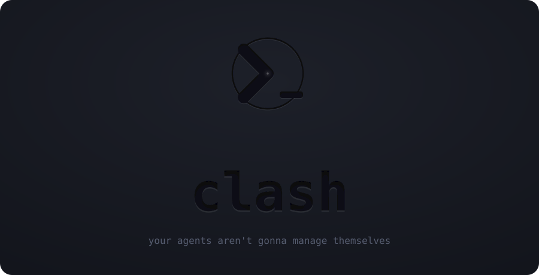

<p align="center">
  
</p>

<p align="center">
  <strong>GUI & Terminal UI for Claude Code Sessions, Agent Teams & Dev Workflows</strong>
</p>

<p align="center">
  The <a href="#gui-primary-mode">GUI</a> is the primary way to use clash;
  the TUI is the terminal-native fallback mode.
</p>

<p align="center">
  <a href="#installation">Install</a> &bull;
  <a href="#features">Features</a> &bull;
  <a href="#usage">Usage</a> &bull;
  <a href="#gui-primary-mode">GUI</a> &bull;
  <a href="#workflows-gui">Workflows</a> &bull;
  <a href="#tui-keybindings">TUI keys</a>
</p>

---

## Features

- **One place for every agent session** — list, start, attach, rename, stash,
  resume, reload and kill Claude Code and **OMP** ([oh-my-pi](https://omp.sh))
  sessions, grouped by status (Active / Done / Fail / External) with live
  three-layer status detection (hooks, PTY screen analysis, transcripts). See
  [OMP sessions](#omp-sessions).
- **Two frontends, one core** — a desktop **GUI** (Tauri; the primary mode) and
  a keyboard-driven **TUI**. Both are backed by the same in-process PTY daemon,
  and several instances can run side by side.
- **Desktop workspace (GUI)** — cmux-style workspaces, freely nested, drag-to-split
  resizable panes, GPU-rendered terminals, shell terminals, embedded **browser tabs**,
  12 themes, a searchable font picker, and a layout restored exactly on
  relaunch. See [GUI](#gui-primary-mode).
- **Workflows (GUI)** — one item per piece of work, taken through plan →
  review → implement → diff review → (optional) PR by agents, with you approving
  each step:
  - line comments on the diff;
  - repeatable agent review rounds (plan, code, plan-vs-changes);
  - explanations of the plan and of the change;
  - a **suggested next step** on every item, with an optional autopilot;
  - multi-repo PRs and a PR dashboard;
  - sharing to Slack / Discord / Jira.

  See [Workflows](#workflows-gui).
- **Attention inbox (GUI)** — one ordered list (`⌘I`) of everything waiting on
  you: approvals, dead agents, errors, decisions, unanswered PR threads,
  finished turns.
- **Files (GUI)** — a file explorer (`⌘E`) on the focused session's folder:
  git status on every file, fuzzy find (`⌘P`), syntax-highlighted / Markdown /
  image previews, and `@`-mentioning a file into the session. See [Files](#files).
- **Queued follow-ups** — type the next instruction while an agent works; clash
  delivers it the moment the session is idle at its prompt, never to a
  tool-approval question.
- **Takeover of outside sessions** — `claude` processes started elsewhere show
  up as wild rows; one confirm moves their conversation under clash.
- **Git worktrees** — start a session in an isolated worktree for parallel
  branches; diffs, PR detection and *open in IDE* (Cursor, VS Code, Zed,
  JetBrains, vim…) per session.
- **Open externally** — send one or all sessions to panes / tabs / windows of
  your terminal (tmux, iTerm2, WezTerm, kitty…) with a planned layout.
- **Teams & tasks** — create and edit Claude Code agent teams and their members,
  tasks and per-agent inboxes; jump from a running member to its session.
- **Scratches** — an IntelliJ-style tree of free-form notes and folders, opened
  in your editor of choice.
- **Session presets** — reusable directory / worktree / prompt / setup-script
  templates, per project or global (Superset-compatible).
- **Layered configuration** — one `config.toml` shared by both frontends, with
  project and env overrides, live reload and `clash config` to inspect it.
- **Self-updating** — `clash update`, `:update` or the GUI's *⟳ Update clash*
  updates both binaries in place.
- **Guided tour** in both frontends, `--debug` logging, and UI state persisted
  across restarts.

## Installation

### Quick install (Linux / macOS)

```bash
curl -fsSL https://raw.githubusercontent.com/defgenx/clash/main/install.sh | bash
```

This installs the **TUI** (`clash`) from the latest release. For the GUI, build
from a clone with `make install` (below).

Custom install path:

```bash
CLASH_INSTALL_DIR=~/.local/bin curl -fsSL https://raw.githubusercontent.com/defgenx/clash/main/install.sh | bash
```

### Build from source

```bash
cargo install --git https://github.com/defgenx/clash.git   # the TUI only
```

Or from a clone — installs **both** the TUI and the GUI
(override paths with `INSTALL_DIR=~/.local/bin` / `APP_DIR=~/Applications`):

```bash
make install            # or: make install-tui / make install-gui
```

The TUI installs as the `clash` binary in `INSTALL_DIR`. The GUI installs
as a regular desktop application, discoverable like any other app:

- **macOS** — `Clash.app` in `/Applications` (falls back to
  `~/Applications` when not writable): Spotlight, Launchpad, Dock. A
  `clash-gui` symlink lands in `INSTALL_DIR` for terminal launching.
- **Linux** — `clash-gui` binary plus an XDG `clash.desktop` launcher
  entry and icon (system-wide under `/usr/local/share` as root,
  per-user under `~/.local/share` otherwise).

### Requirements

- Claude Code CLI (`claude`), and/or OMP (`omp`, oh-my-pi) for OMP sessions
- `git` (worktrees, diffs) and, for every PR feature, the GitHub CLI `gh`
- Building from source: a recent stable Rust (1.82+); for the GUI on Linux,
  the webkit2gtk / GTK development packages (see [GUI](#gui-primary-mode))

## Usage

```bash
clash                              # Start the TUI (reads from ~/.claude)
clash-gui                          # Start the GUI
clash --data-dir ~/.claude         # Custom data directory
clash --claude-bin /path/to/claude # Custom CLI path
clash --debug                      # Enable debug logging
clash update                       # Update clash and clash-gui to the latest release
clash config [--path|--defaults|--validate|--schema]   # Inspect configuration
clash attach <session-id>          # Attach to a session owned by a running clash (used by external panes)
clash daemon                       # Run the session daemon standalone (normally in-process)
clash --version
```

At every launch, clash (re)writes its lifecycle hooks to `~/.claude/clash/hooks/` (plus the OMP status extension) for instant status detection; the first launch also shows a guided tour. Replay it anytime with `:tour`. clash passes that hook file to every session it spawns (`claude --settings …`), so it registers nothing in your own settings files — see [docs/hooks.md](docs/hooks.md).

### Session Status

clash detects session status through three layers (in priority order):

1. **Hooks** — Claude Code lifecycle events (`PermissionRequest`, `Stop`, `SessionStart`, etc.) write instant status updates
2. **Daemon PTY** — screen content analysis pattern-matches the terminal for prompts, approval dialogs, and thinking indicators
3. **JSONL baseline** — conversation log heuristics (last entry type, stop reasons, timing)

| Icon | Status | Meaning |
|------|--------|---------|
| `◆◇` | Prompting | Claude needs tool approval — blinking diamond |
| `◉` | Waiting | Awaiting your next prompt |
| `◌◎◉` | Thinking | Reasoning / generating — pulsing circle |
| `⠋⠙⠹…` | Running | Executing tools — braille spinner |
| `○◔◑◕●` | Starting | Session just spawned — filling circle |
| `✗` | Errored | Session crashed shortly after starting |
| `○` | Stashed | Exited or inactive |
| `✓` | Done | A subagent that finished |

### Session Source Prefixes

Each row in the sessions list may carry a single-character prefix indicating where its underlying Claude process lives:

| Prefix | Source | Meaning |
|--------|--------|---------|
| (none) | Daemon | clash spawned and manages the PTY — attach inline with `a` |
| `⊞ `  | External | clash spawned the process in another pane/tab/window via `o`/`O` |
| `🌿 ` | Wild | A `claude` process started outside clash. Press `a` to take over: one confirm, then clash kills the outside process (SIGTERM, SIGKILL after 2s) and attaches to its conversation under the daemon (`--resume <id>`) |

The Wild detection runs in the background every ~2s. clash surfaces every wild claude PID **that started after this clash launched** under the EXTERNAL section — pre-existing claudes from before clash booted are intentionally hidden, the section is for things spawned during this session. Each wild process is **dynamically associated with a conversation**: exact evidence first (`--resume <id>` / `--session-id <id>` in argv, or — rarely — the `.jsonl` held open as an fd), otherwise the **most recently modified conversation in the process's working directory**. The association is re-evaluated on every scan, so it always tracks the latest conversation. Only a bare `claude` in a directory with no conversation on disk at all (typically the few seconds before a brand-new conversation's JSONL appears) shows as a PID-keyed row with takeover disabled. Press `d` to drop a wild row: clash signals the PID directly (SIGTERM, SIGKILL after 5s if still alive and still claude). The row also disappears on the next scan tick once the process exits, so closed/stopped claudes never linger. List the section in isolation with `:external`. The GUI behaves the same way: clicking a wild row (or its ⚡ button) confirms, takes over, and opens the terminal.

## GUI (primary mode)

The GUI is the primary way to use clash; the TUI remains fully supported as the
terminal-native mode. It is a Tauri 2 desktop app (`gui/`) sharing the TUI's
core: the session pipeline, the in-process PTY daemon and the protocol. Both
can run side by side, each instance owning its own sessions. Everything in this
section except [Files](#files) and [Workflows](#workflows-gui) also exists in the TUI.

The first launch opens a **guided tour**, a spotlight walkthrough of
workspaces, starting a session, sessions, the inbox, workflows, scratches,
teams, files, tabs and panes, the terminal and settings. Replay it from *Settings →
▶ Show the tour*.

### Workspaces, panes and tabs

- **Workspaces** (cmux-style) each own a pane layout *and* their sessions:
  - `⌘N` creates one, `⌘1–9` switches, and `⌘⇧R` or a double-click on the chip renames it.
  - `⌘⇧W` or the chip's `×` closes it; the last one can't be closed.
  - The sidebar is scoped to the active workspace, plus an **UNASSIGNED** group
    for sessions no workspace has claimed (opening one claims it).
  - Search (`/`, `⌘F`) is global; results from other workspaces carry a `⌘n` badge.
- **Split panes** nest freely, like iTerm:
  - `⌘D` splits the focused pane (beside it when it is wide, below it when it is
    tall) and `⌘⇧D` closes it.
  - Drag a tab — from the strip or a pane's title bar — onto any pane: drop it on
    an edge to split that pane on that side, or in the middle to show it there
    (swapping with the pane it came from). Dragging a pane's tab moves the pane.
  - Drop it on the outer edge of the whole pane area instead to get a pane that
    spans that side — e.g. one full-width pane under several columns.
  - Closing a tab closes its pane; the neighbouring panes take the space.
  - `⌘⇧↩` (or a double-click on the pane title) zooms.
  - `⌘⌥←/→` cycles focus.
  - Drag a divider to resize; the layout persists per workspace.
- **Tabs**: the active tab is always the content of the focused pane. The `+`
  ghost tab opens a shell terminal, a browser tab or a new session; right-click
  an empty pane for the same menu.
  - Double-click a label to rename; middle-click or `⌘W` closes.
  - Closing an agent tab **stashes** the session (stopped, conversation kept
    resumable); choose *Detach* in the tab menu to leave it running instead.
- On relaunch clash restores **where you were**: workspace, tabs, layout,
  focused pane and browser tabs. Stashed sessions resume the moment you click
  them.

### Sessions

- **Status**: the sidebar shows status sections with animated status labels
  (PROMPTING / THINKING / RUNNING / WAITING / STARTING / STASHED / ERRORED /
  DONE), and each tab gets a colored dot. Every row carries a **CC** / **OMP**
  agent badge.
  - STASHED means *resumable*: sessions are stashed when clash starts, because
    a transcript can't say whether its process still lives.
  - Sessions whose conversation Claude Code has deleted (after ~30 days) stop
    being listed.
- **New session** (`＋ New session`, `⌘T`):
  - pick a directory (prefilled from the default directory or the focused
    project, with a 📁 picker);
  - pick a preset, optionally a git worktree, and the agent (Claude Code or
    OMP; one whose binary doesn't resolve is greyed out).
- **Session actions**: each row's `⋯` menu (or right-click) offers rename,
  ⟳ reload, details, stash, kill, open PR, queue or cancel a follow-up, and
  take over (for wild rows).
- **External claudes** started outside clash are listed under `⚡ EXTERNAL`.
  Clicking one takes it over after a confirm: the outside process is killed
  and its conversation opens under clash.
- **Section buttons**: every section header has `✕` (kill the whole group, one
  confirm). The topbar's **⏸ all** stashes every running session.
- **⟳ Reload** hot-restarts a session on the newest `claude` binary, resuming
  its latest conversation. It is on rows, tabs and section headers, and `⌘R`
  reloads the focused session. Busy sessions are skipped by group reloads, and
  an individual reload asks first.
- **Details panel** (ⓘ): status, branch, project, CWD and summary, plus *Ports*,
  *Open in IDE* and *Open in browser* (the PR, the diff on GitHub, or the repo).
  Conversation, Subagents and Diff open as full tabs.
- A session whose output mentions a GitHub PR gets a green `⇄ PR #n` chip.

### Terminals

- Terminals are xterm.js with GPU (WebGL) rendering; a lost GL context is
  reacquired automatically.
- **Shell terminals**: the topbar button picks among the machine's shells, and
  `⌘⇧T` reopens the last one. Closing the tab kills the shell.
- **Keyboard**:
  - `Shift+Enter` inserts a newline in agent sessions.
  - `⌘C` / `⌘V` copy and paste (`Ctrl+Shift+C/V` on Linux); plain `Ctrl+C` interrupts.
  - `⌘K` clears the terminal.
- **Selecting text**: Claude Code captures the mouse, so **⌥-drag** (Shift on
  Linux) to select text. Right-click selects a word.
- **International layouts**: ⌥ composes characters (`{`, `[` on AZERTY).
  *⌥ sends Esc (Meta)* keeps ⌥+letter as Meta.
- **Notifications**: a desktop alert fires when a session starts waiting or
  errors (not while the window is focused). Any process can raise one with
  `printf '\e]777;notify;Title;Body\a'` (OSC 9 / 777).

### Browser

- Browser tabs are first-class tabs. `⌘⇧B` opens a blank one in its own split.
- Full chrome: back/forward, reload/stop, an address bar taking URLs or
  searches, copy URL, open in the system browser and DevTools.
- While focused: `⌘L` focuses the address bar, `⌘R` reloads, and
  `⌘+` / `⌘-` / `⌘0` zoom.
- `target="_blank"` links open a new clash tab.

**How links open** is one setting, *ask* (default), *in clash* or *system
browser*. It applies to every link clash opens: terminal URLs, PR buttons and
chips, listening ports, and links in rendered plans and reviews. A link opened
in clash goes to a new split beside the current session.

### Files

The **Files** panel (`⌘E`, or the folder button in the topbar) is a file
explorer docked to the right of the panes.
- **Root**: it shows the focused session's folder and follows you as you switch
  sessions. 📌 pins the current folder; the folder button shows any other one
  (pinned). Click the folder name to reveal it in Finder.
- **Tree**: folders load as you expand them and remember what was open per
  folder. Git-ignored files are hidden (◌ shows them, dimmed), `.git` never
  appears, and the panel refreshes every few seconds while it is open.
- **Git status**: the header shows the branch and ahead/behind counts. Files
  are marked **M**odified, **A**dded, **D**eleted, **R**enamed, **U**ntracked or
  **!** (conflict), and a collapsed folder holding changes shows `•`.
- **Find** (`⌘P`, or type in the filter box): fuzzy search over every file git
  knows about (tracked and untracked, not ignored); outside a repository it
  walks the folder, skipping dot-folders and `node_modules`/`target`-style
  trees. Matched letters are highlighted.
- **Keyboard**: `↑`/`↓` move, `→`/`←` open and close a folder, `↵` previews,
  `⌥↵` mentions the file in the session, `Esc` clears the search.
- **Preview**: clicking a file opens it in a preview pane beside the session.
  Code is syntax-highlighted with line numbers, Markdown is rendered (mermaid
  included) with a *Source* toggle, and images are shown. Binary files and
  text over 2 MB are not previewed.
  - Clicking another file replaces the preview (its tab is in *italics*).
    Double-click, `↵` or 📌 *Keep* keeps a tab open.
- **Actions** (right-click a row, or the preview's toolbar): *Mention in
  session* types `@path` into the session (relative to its folder), *Open in
  editor…* (the scratch editor picker), copy the absolute or relative path or
  the name, reveal in Finder, and for folders *New terminal here* and *Show as
  root*. Dragging a row into a terminal types its path.

### Teams

The TEAMS section lists real, user-managed teams, each with a live `n/m`
running count; Claude Code's per-session `session-<id>` teams are hidden.
- A team's panel lists its members with run indicators and model chips. Left-click
  a running member to jump to its session, or a stopped one to open its inbox.
- Right-click a member to edit its model, agent type, prompt or name, remove it,
  or open its inbox. **＋ Add member** adds one.
- Tasks can be created, have their status cycled (click the badge), get an owner,
  or be deleted.
- The name and description are click-to-edit, and the panel live-refreshes.

### Inbox

The **inbox** (sidebar tray icon, `⌘I`) answers "what needs me?" as one list
across every workspace and project, ordered by urgency, then by how long each
has waited:
1. sessions holding a tool-approval prompt;
2. workflow agents that died mid-round;
3. errored sessions;
4. workflow items parked on a decision;
5. PRs with open review threads;
6. sessions waiting for your next message.

The count turns red only when something is blocked. Clicking a row jumps to it.

### Queued follow-ups

**Queue follow-up…** (a running session's `⋯` menu, the inbox, or `f` in the
TUI) delivers a multi-line prompt to that session the moment it is idle at its
input prompt. `⧖n` on the row shows pending prompts; click it (or `F` in the
TUI) to review or cancel one.

It is safe to leave running:
- delivery waits for two consecutive idle samples and never goes to a
  tool-approval question;
- the text arrives as one bracketed paste plus one Enter;
- each session holds at most 20 queued prompts;
- the queue is in memory for that clash instance;
- every delivery is announced by a toast.

### Settings

The sidebar's collapsible **SETTINGS** section is grouped and filterable (type
"cursor" or "font"), and every terminal setting applies live:

| Group | Settings |
|---|---|
| **Appearance** | Theme — 12 palettes (below) |
| **Paths** | default session directory · scratch directory · workflows directory · `claude` binary · OMP binary · default agent (Claude Code / OMP) |
| **Workflows · agents** | workflow agent (ask / Claude Code / OMP) · lead model · next-step assist (suggest / autopilot / off) · delegation (team / solo) · subagent model · OMP model · PR skill · forge · skill updates |
| **Workflows · sharing** | who posts to Jira (agent / clash) · Jira skill · Jira site, email, API token · who posts to Slack/Discord (agent / clash) · chat skill · Slack and Discord webhooks |
| **Workflows · notifications** | notify decisions (off / Slack / Discord) |
| **Terminal · text** | font family (searchable picker) · size · weight · bold weight · line height · letter spacing |
| **Terminal · cursor** | style · unfocused style · bar width · blink |
| **Terminal · colors** | minimum contrast ratio · bold in bright colors |
| **Terminal · scroll & input** | scrollback · scroll speed · smooth scroll · copy on select · right-click selects word · ⌥ sends Esc · toast on bell |
| **clash** | how links open · desktop notifications · attention count in the title · confirm before kill · refresh interval · default shell · TUI launcher terminal |

Theme, terminal and link settings are the GUI's own (`gui-state.json`).
Everything else lives in the shared [`config.toml`](#configuration), so the TUI
agrees.

**Themes** recolor the chrome and the terminals together:

| Dark | Light |
|---|---|
| clash dark *(default)* · Tokyo Night · Catppuccin Mocha · Nord · Dracula · One Dark · Gruvbox Dark · Solarized Dark | clash light · Catppuccin Latte · Solarized Light · GitHub Light |

The **font picker** lists the installed families, each previewed in its own
face and tagged *mono* or *proportional*. *Monospace only* is on by default, and
*Custom…* takes a full CSS font stack.

The sidebar and details panel are drag-resizable. The WORKFLOWS / SCRATCHES /
TEAMS sections have a draggable divider and their own scrollbars.

The **TUI** badge in the sidebar header launches the clash TUI in a detected
terminal (Terminal, iTerm2, WezTerm, kitty, Alacritty, Ghostty, Warp, GNOME
Terminal, Konsole, xterm, tmux). It turns gold while a TUI is running.

### Updates

- **⟳ Update clash** (below the settings), like `clash update` and `:update`,
  updates **both** binaries. Progress shows in the footer version label.
- A Restart dialog stashes every session, relaunches the new binary, and logs
  the relaunch in `clash.log`.
- Symlinked installs are followed. On macOS the binary inside `Clash.app` is
  replaced, its version bumped and the bundle re-signed.

### Keyboard shortcuts

| Key | Action |
|---|---|
| `⌘T` / `⌘⇧T` | new session / new shell terminal (last-used shell) |
| `⌘N` · `⌘1–9` · `⌘⇧R` · `⌘⇧W` | new / switch / rename / close workspace |
| `⌘D` / `⌘⇧D` | split / close the focused pane |
| `⌘⇧↩` · `⌘⌥←/→` | zoom pane · cycle pane focus |
| `⌘W` | close the active tab (agent: stash, shell: kill) |
| `⌘B` | toggle the sidebar |
| `⌘E` / `⌘P` | toggle the Files panel / find a file |
| `⌘⇧B` | new browser tab |
| `⌘F` or `/` | search |
| `⌘I` | inbox |
| `⌘K` | clear the terminal |
| `⌘R` | reload the focused session (in a browser pane: reload the page) |
| `⌘L` · `⌘+`/`⌘-`/`⌘0` | browser: address bar · zoom |
| `Esc` | close the new-session dialog / clear the search |

Text fields support `⌘A` / `⌘C` / `⌘X` / `⌘V` and forward delete (fn+⌫; ⌥ =
word, ⌘ = to end of line). Dialogs take Enter / Esc, and composers send with
`⌘↵`.

### Building

```bash
cargo build --release           # builds BOTH binaries: clash and clash-gui
./target/release/clash-gui
```

On Linux the build needs the Tauri system packages:
`libwebkit2gtk-4.1-dev libgtk-3-dev librsvg2-dev libxdo-dev`. The GUI is
self-contained: there is no external daemon and no node build step, since the
frontend in `gui/dist/` is vendored and embedded in the binary.

## Workflows (GUI)

A pipeline manager for AI-assisted development: one **item** per piece of work,
taken from idea to plan to code to PR by Claude Code (or OMP) agents, with you
approving every step. Everything is plain files, so an item's whole history
stays readable outside clash. The agent-side file contract and the design
behind each rule are in [docs/workflows.md](docs/workflows.md). Workflows are
GUI-only.

### Starting an item

The `+` button on the WORKFLOWS section asks how the item starts:

| Mode | Starts at | Use it when |
|---|---|---|
| **Full workflow** | `draft` | you have an idea: an agent plans, you approve, it implements |
| **From a plan I already have** | `plan-review` | the plan exists: paste it, point at a markdown file, or pick a scratch note. No planning agent runs |
| **Review only** | `diff-review` | the code is already written: give a **PR** (URL or number) or a **local branch** and get just the review loop |

Give it a title, a project and a repo (picked from your open sessions and
existing projects, or **Browse…**), and optionally a **description** of the goal.
The planning agent reads the description first, which saves half the
requirements questions.

**Review only** resolves the PR through `gh`, checks its branch out (reusing an
existing worktree of it), and diffs against the PR's own base. A PR URL is
looked up in its own repository, so a link to another repo is refused by name
rather than resolved to whatever local PR shares the number. No plan is written
and no draft-PR stage runs, since the PR isn't clash's.

Planning reads the repo in place. The first round that writes code gets its own
git worktree and branch, unless the directory isn't a git repository or the
item is set to work in place.

### The pipeline

`draft → planning → plan-review → changes-requested → implementing →
diff-review → pr-draft → pr-ready → done`, plus `abandoned` from anywhere and
`reviewing` while an agent review round runs.

- The **PR stages are optional**: approving a diff can close the item outright,
  for repos that merge straight to their default branch.
- A **pipeline stepper** at the top of every item shows the mode's stages,
  where the item is, and how many rounds it has been through.
- Decision stages (plan review, diff review, PR draft) badge the sidebar, fire a
  desktop notification and appear in the [attention inbox](#inbox).
- An item **follows its primary PR**: merged on GitHub → `done`; flipped to
  ready for review on GitHub → `pr-ready` on the next refresh.

### The action bar

Every item ends with an action bar in three labeled zones:
- **This step · stays here** — reviews, explanations, opening the PR or the session.
- **Continue · moves the item** — the decisions that advance the pipeline.
- **Item · back, park, share** — the item as a whole.

Above the zones, a **Suggested next** strip names the one button to press now
and why, along with what it already checked:

1. a review round came back and isn't applied yet → **↻ Apply**
2. comments are still open → **✎ Request changes…**
3. PR threads are waiting on you → **⇄ Answer PR threads**
4. this iteration's plan or code has no review yet → **⌕ Plan review** / **⌕ Code review**
5. nothing has compared the change with the plan → **⇄ Compare plan vs changes**
6. otherwise → **Approve**

It only ever points at a button that is on the bar, and it moves the highlight
there. The agents advise too, through a `**Next:**` line at the end of every
review round and of the executor's hand-off, but clash's own checks rank first.
"Reviewed" means reviewed **at this iteration**: after a fix round, the code is
due for review again.

`workflows.assist` sets how far it goes (*Settings → Workflows · agents*):
- `suggest` (the default) highlights the step.
- `autopilot` also starts it after each agent hand-back, but only steps that
  decide nothing: a review, a plan-vs-changes round, or applying a round that
  said apply. It stops before every approval, PR flip, change request and
  GitHub post, and after 3 steps on an item until you click something there.
- `off` gives the plain bar.

### Reading an item

| Tab | Holds |
|---|---|
| **Plan** | the current `plan.md`, rendered; *Edit plan.md* opens it in your editor |
| **◫ Revisions** | every plan version (one per applied review round), any version's full text, and **⇄ Changes** between any two |
| **Diff** | the change, with line comments; its source picker can also show a linked PR's diff (view-only) |
| **Change requests** | *your* notes, one section per round — what the next agent round reads first |
| **↩ Hand-off** | the workflow agent's note from its last phase: what it did, what it is unsure about, what it tested, what it suggests next |
| **Agent reviews (n)** | every review round's verdict and findings, with jump chips, opening on the latest |
| **◫ Plan explained** / **◫ Changes explained** | the explainer's two documents (see below) |
| **⇄ Plan vs changes** | the latest plan-vs-changes comparison |
| **Timeline** | one newest-first feed of every change round (your note, the plan diff, the plan as it stood, the code diff) and every review round |
| **⚙ Settings** | per-item knobs: title, description, diff base, agent CLI, PR skill, default interaction mode, work in place, session-name prefix, Jira ticket — plus the item's facts |

Workflow sessions are named by item and job (`Auth refactor · implement`,
`· plan review r2`, `· code review r1`, `· explain plan`, `· plan vs changes r1`,
`· answer PR comments`), so the sessions list says what each agent is doing.

### Reviewing the diff yourself

Hover any diff line and press `+` to leave a GitHub-style comment. Threads
support reply, edit, resolve, *won't fix* and *park* (kept, but not sent with
the next round). The ↑/↓ buttons in the diff header step through open comments,
expanding collapsed files on the way. Comments re-anchor by content when the
diff moves between iterations, and are never dropped: one that can't be placed
lands in an orphan tray.

### Requesting changes

**✎ Request changes…** opens a composer. The note is appended verbatim to
`review.md` and is the first thing the next round reads, so it is effectively
that round's prompt. The composer offers:
- a **What to change / Why / Out of scope** template;
- *Insert review findings…* from any review round;
- a preview of exactly what will be recorded;
- the queued comments as rows you can untick (park), jump to or delete;
- **After recording**: record only, or launch the fix round now, choosing how
  it runs and, optionally, a different executor skill.

⌘↵ sends, and a dismissed composer keeps its draft.

Recording a round freezes the iteration first (diff, plan and comments under
`history/`), so every round has a before and after. Where the request lands
decides what the agent may touch:
- At **plan review**, the round revises the plan.
- Everywhere else, it changes the **code** and never rewrites `plan.md`. To
  amend the plan, use **↩ Move back to… → plan-review** first.

When the item has a PR, the fix round pushes so the PR follows.

### Agent review rounds

**⌕ Plan review** (at plan review) and **⌕ Code review** (diff review and both PR
stages) hand the item to a reviewer agent. A round is a side trip: the item goes
to `reviewing` and comes back exactly where it started. Rounds are unbounded,
and nothing advances until you approve. Rounds are numbered per target, so the
first code review is *Code review 1* however many plan reviews came before it.

The launch composer shows the round's whole shape before anything spends tokens:

| Choice | Options |
|---|---|
| **Which change?** | multi-repo items only: this repo's own diff and/or any of the item's PRs, in one round |
| **Depth** | code and drift rounds: `deep` (default; traces callers, invariants and existing tests) or `standard` |
| **Findings** | keep local (default) or also post to the PR — one review with line comments, never an approval; on a draft PR the summary goes as a comment, since GitHub refuses reviews on drafts |
| **Interaction** | ask when it starts (default), interactive, or autonomous |
| **Apply when done** | let a round that says "apply" start the fix round by itself |

**Interactive or autonomous is your call.** An interactive round asks its open
questions in one batch, each with a recommended answer. It then walks you
through its findings before writing anything: you keep, drop or regrade each
one, and plan issues come with lettered options. It asks before any trivial fix
or PR post. An autonomous round decides alone and reports at the end. The
executor phases start with the same question.

Code findings arrive as **diff comments** graded `BLOCKER`/`RISK`/`GAP`/`NIT`,
which you triage like your own. The verdict and plan findings go to
**Agent reviews**. When a round finishes, a toast and a strip on the item say
what it concluded and what it published. **↗ Post round N to PR** shares an
existing round later, with no new review. A reviewer may fix only trivial
mechanical issues, after asking, and never rewrites what it reviews. While a
round runs, approval and the comment editor are locked. **End round** always
unlocks them, so a crashed reviewer can't wedge an item; a dead executor gets
**⚠ Relaunch agent**.

### Applying a round

Every round ends with `**Apply:** yes|no — reason` (are the findings worth a
revision round?) and `**Next:** <action> — reason`. clash shows the call on the
button: **↻ Apply plan review 2 → revise plan · recommended** (or *not needed*).
One click composes the note from the round's findings, records it as the next
change round and launches the agent. *Edit the note first…* opens the composer
pre-filled, for "apply 1a and 3b". Until a round is applied, the item header
says **not applied yet** and the stage's own Approve steps back.

### Explaining

**◫ Explain plan** reads `plan.md` and the code it will land in, and explains
what the implementation is *going* to do before it exists. **◫ Explain changes**
reads the diff and explains what the change *did*. Each run writes two forms:
- a written walk-through with mermaid diagrams;
- one hand-drawn page of boxes and arrows (the parts, the repos, what is new),
  rendered sandboxed with scripts off.

The tab opens on the drawing. **◫ Diagram / ☰ Write-up** switches form, and
**⤢** gives the drawing the whole tab. An explainer judges nothing, runs
alongside the item's other agents without blocking it, and can be told what to
focus on.

### Comparing plan vs changes

**⇄ Compare plan vs changes** reads `plan.md` and the diff together, to answer
the question neither review can: did we build what we agreed to? Every
divergence has:
- a direction: **missing**, **extra** or **different**;
- a grade on consequence, not size: **intended**, **benign** or an **issue**.

A test or migration the plan promised and the change skipped is an issue.
Issues arrive as diff comments, so ↻ Apply or Request changes turns them into a
fix round. Drift resolved by amending the plan is reported instead, because a
fix round never rewrites `plan.md`: move the item back to plan review for that.
Launching it offers to refresh any explanation written for an older iteration
alongside it, pre-ticked; it runs in parallel, and the comparison doesn't wait
for it.

### Going back

**↩ Move back to…** lists the stages behind the current one, with what each is
for. Clicking a passed stage in the stepper does the same. Only the stage moves:
the plan, diff, comments, PR and rounds all stay, and no agent runs. A finished
or abandoned item offers **↩ Reopen at diff review**.

### Pull requests

- **Create draft PR…** offers two ways to write the description: from the plan
  (free, instant) or by the agent from the real diff (spends tokens). A branch
  that was never pushed is pushed first.
- **✓ Mark PR ready** flips the draft once you have validated it. **✓ PR is
  ready → PR ready** records a PR already flipped on GitHub. **✓ Mark done**
  closes the item at either PR stage.
- **⇄ Answer PR threads** launches an agent that reads every review thread,
  fixes the trivial ones with commits, replies in each thread, and queues the
  rest as comments for you. The button shows how many threads are open (a
  thread is settled only when your reply is its last word, so findings clash
  itself posted count until they get a decision) and says *all answered* when
  nothing is.
- **PR skill** (*Settings → Workflows*, default `hivebrite-engineering:github-pr`,
  `none` disables, per-item override in ⚙ Settings): agent-written PRs go
  through that skill, so they follow your org's titles, templates and ticket
  links.
- **`workflows.forge`** (`auto` | `github` | `none`): `auto` detects GitHub from
  the origin remote (GitHub Enterprise included). `none` hides every PR feature.
- A command that needs a PR the item doesn't know asks for its URL, attaches it
  and retries. A review round can run locally instead.

### Multi-repo work

**🔗 Link a PR…** attaches PRs from other repositories. They show as chips in the
item header and refresh with the primary. Only the primary PR moves the item's
status; an item with *only* linked PRs closes when all of them merge. Once an
item has several PRs, every PR action asks which ones (any subset, with an
all/none toggle):

| Action | Pre-ticked |
|---|---|
| **Open PRs (n)…** — the first in a split pane, the rest as browser tabs | all |
| **✓ Mark PR ready…** — drafts only; only the primary moves the item | the primary |
| **↗ Post round N to PR…** | the primary |
| **⌕ Code review** — one round over several diffs; a linked PR's findings are posted to that PR | this repo's own diff |
| **⇄ Answer PR threads…** | every PR with open threads |

Every PR chip also has a right-click menu with that PR's actions. The **⇄ PR
dashboard** (button on the WORKFLOWS section) lists every item holding a PR
across all projects, decisions first and merged last.

### Share & notifications

**↗ Share…** composes one document from the item (summary, plan, rounds,
verdicts, open comments, diff) from three presets with per-section checkboxes.
The preview **is** the payload. It can go to:
- the clipboard;
- a `.md` or self-contained `.html` file;
- Slack or Discord;
- a Jira ticket as one comment. The key is pre-filled from the item's
  remembered ticket or detected in its title or branch.

Who posts a share is a per-destination setting (`jira_transport` /
`chat_transport`):
- **An agent session** (the default) posts it through a skill you name, or else
  with whatever tooling that session has connected.
- **clash itself** posts over HTTPS with the webhook or Jira credentials.

Neither route is a fallback for the other, and each button names its route.

**Notify decisions** (`notify_webhook`, off by default) announces every item an
*agent* parks at a decision stage on the configured webhook. Your own clicks
never post.

### Agents, models and skills

- **Agent CLI**: workflow sessions run on Claude Code or OMP. `workflows.agent`
  defaults to `ask` at every step and can be fixed per item. See
  [OMP sessions](#omp-sessions).
- **Lead and subagents**: every Claude workflow session runs on one pinned
  **lead model** (`workflows.lead_model`, default `claude-opus-5-5`). Under
  `workflows.delegation = team` (the default), the lead may split work across
  parallel subagents on `workflows.subagent_model` (default `claude-sonnet-5-5`).
  It sizes the round first: small work stays with the lead, and large work gets
  explorers, implementers in waves of disjoint files, or one reviewer per area,
  followed by verification. `solo` keeps everything in one session.
  [Details](docs/workflows.md#lead-and-subagents).
- **Skills**: the agent side is five skills embedded in the binary:
  - `clash-workflow` — the executor: plans, implements, opens PRs, writes the hand-off;
  - `clash-plan-review` — the plan reviewer;
  - `clash-code-review` — the code reviewer;
  - `clash-explain` — the explainer;
  - `clash-drift-review` — plan vs changes.

  Startup installs missing skills and refreshes the ones you never edited.
  clash asks (*Keep my edits* / *Overwrite*) only when an upgrade would replace
  a skill you edited by hand; `general.skills_update` pins the answer. The ☰
  button on the WORKFLOWS section lists every installed skill and badges the
  ones clash manages.

### Storage

`~/.claude/clash/workflows/<project>/<item>/` (or `workflows_dir`) holds:
- `meta.json` and `plan.md`, with `plan-history/` for its versions;
- `review.md` (your decisions) and `agent-review.md` (the reviewers' rounds);
- `annotations.json`;
- `explain-plan.*`, `explain-diff.*` and `drift.*`;
- `handoff.md` and `explainers.json`;
- `history/<NNN>/` round snapshots.

The contract for what agents may write, and when, is
[docs/workflows.md](docs/workflows.md).

## TUI keybindings

### Navigation

| Key | Action |
|-----|--------|
| `j` / `k` | Select next / previous |
| `g` / `G` | Jump to first / last |
| `Enter` | Drill in |
| `Esc` | Go back |
| `r` | Refresh |
| `q` / `Ctrl+C` | Quit (with confirmation; `Ctrl+C` again while shutting down force-quits) |

In dialogs: `y` / `n` (or `Esc`) answer a confirmation; pickers take `j`/`k`,
`Enter`, `Esc`; text fields support the usual readline keys (`Ctrl+A/E/U/K/W`,
`Alt+B/F/D`). The tour advances with `Enter`/`Space`/`→` and is skipped with
`Esc`/`q`; the help overlay scrolls with `j`/`k` and closes with `?`/`Esc`/`q`.

### Modes

| Key | Description |
|-----|-------------|
| `:` | Command mode — `:teams`, `:sessions`, `:tour`, `:update`, `:quit` |
| `/` | Fuzzy filter |
| `?` | Context help |

### Sessions

| Key | Action |
|-----|--------|
| `Enter` / `i` | Open the session detail |
| `a` | Attach (inline terminal); on a 🌿 wild row: take over and attach (one confirm) |
| `p` | View git diff |
| `e` | Open project in IDE (auto-detect + picker) |
| `f` | Queue a follow-up prompt — delivered when the session is next idle |
| `F` | Cancel a queued follow-up (picker when several are pending) |
| `o` | Open in new pane / tab / window |
| `O` | Open ALL running sessions (smart layout) |
| `c` / `n` | New session (directory, name, worktree?, then agent: `claude`/`omp`) |
| `s` | Stash / unstash session (stop process, keep in registry) |
| `w` | Spawn session in a git worktree |
| `Tab` | Expand / collapse subagents |
| `A` | Cycle section filter (All/Active/Done/Fail/External; Fail is skipped under `:active`) |
| `S` | Stash / unstash ALL sessions (with confirmation) |
| `d` | Drop session |
| `D` | Drop ALL sessions |

### Teams

| Key | Action |
|-----|--------|
| `Enter` / `i` | Open the team's detail (its members and tasks from there) |
| `c` | Create team |
| `R` | Rename team (moves its config + tasks) |
| `d` | Delete team |
| `e` | Edit team description |
| `m` | Add member (name → agent type → model) |
| `x` | Remove member (picker) |

### Attached Mode

A status bar at the bottom shows session name, project, and git branch. The PTY is resized to fit above the bar.

| Key | Action |
|-----|--------|
| `Ctrl+B` | Detach (works across all terminal encodings) |
| Everything else | Forwarded to the session's agent (`claude` or `omp`), mouse scroll included |

### Session Detail

| Key | Action |
|-----|--------|
| `j` / `k` | Scroll |
| `s` / `Enter` | Subagents |
| `t` | Linked team (the Teams list when none is linked) |
| `m` | Team members (all agents when no team is linked) |
| `p` | View git diff |
| `a` | Attach |
| `o` | Open in new pane / tab / window |
| `w` | Spawn a session in a git worktree |
| `e` | Open in IDE |
| `d` | Drop |

### Subagents

| Key | Action |
|-----|--------|
| `Enter` | Subagent detail |
| `a` | Attach to the parent session |
| `o` | Open the parent session in a new pane / tab / window |
| `e` | Open in IDE |
| `p` | View git diff |
| `f` / `F` | Queue / cancel a follow-up for the parent session |

### Diff View

| Key | Action |
|-----|--------|
| `j` / `k` | Scroll diff content |
| `n` / `p` | Next / previous file |
| `r` | Refresh diff |
| `Esc` | Go back |

### Team Detail

Opening a team scopes the Agents and Tasks views to that team. Its member list
marks members whose session is currently running with `●` (`○` otherwise); the
Agents view says `active` / `idle`. Per-member edits are commands run
from a team view — `:member model <name> [model]`, `:member type <name> <type>`,
`:member prompt <name> <text>`, `:member rename <old> <new>`.

| Key | Action |
|-----|--------|
| `Enter` / `a` | View agents (team-scoped) |
| `t` | View tasks (team-scoped) |
| `s` | View lead session |
| `e` | Edit team description |
| `m` | Add member (name → agent type → model) |
| `x` | Remove member (picker) |
| `R` | Rename team |
| `d` | Delete team |

### Tasks

The Tasks view is scoped to the current team.

| Key | Action |
|-----|--------|
| `Enter` | View task detail |
| `c` | Create task |
| `s` | Cycle status (pending → in-progress → completed → …) |
| `a` | Assign owner (picker of the team's members) |
| `d` | Delete task |

In a task's detail view, `s` cycles its status and `d` deletes it (with
confirmation).

### Scratches

Reach the Scratches view with `:scratch` (also `:notes`). Scratches are an
IntelliJ-style **"Scratches and Consoles"** tree: notes and folders you can
nest, rename, and reorganize. Folders sort first; the tree is shown indented
with an expand/collapse caret.

| Key | Action |
|-----|--------|
| `a` / `c` / `n` | New scratch — created inside the selected folder (or alongside the selected note, else at the root) |
| `A` | New folder (same placement rule) |
| `Enter` | Open a file in an editor (picker), or expand/collapse a folder |
| `e` | Open the selected note in an editor (picker) |
| `r` | Rename the selected file or folder |
| `m` | Move the selected file or folder into another folder (picker; choose **/ (root)** to move it back to the top level) |
| `y` | Copy the entry's path to the clipboard (picker: absolute path, path relative to the scratch root, or file name) — IntelliJ-style "Copy Path/Reference…" |
| `d` | Delete the selected entry (folders are removed recursively, with confirmation) |

Scratches are plain files and folders under `~/.claude/clash/scratch/` by
default; override the location with `scratch_dir` in `config.toml` or the GUI
**Scratch directory** setting (which writes the same key, so the TUI honors it
too). The tree **auto-refreshes** when the scratch directory changes on disk
(a note saved from an editor, the GUI, a `git pull`…) via a filesystem watcher
that follows the configured directory. The editor picker lists installed IDEs
(Cursor, VS Code, Zed, JetBrains, …) and terminal editors (vim, nvim, emacs,
nano, helix, micro); terminal editors open in a tab/pane, GUI editors launch
alongside.

`y` copies an entry's path to the system clipboard: it uses the platform
clipboard tool (`pbcopy`/`wl-copy`/`xclip`/`xsel`/`clip`) for local copies and
also emits an OSC 52 escape, so it works over SSH and in clipboard-capable
terminals (iTerm2, kitty, WezTerm, Ghostty, tmux with `set-clipboard on`).

In the GUI, scratches live in a collapsible **Scratches** sidebar section that
renders the same tree: click a folder to expand/collapse it, click a note to
open it, and use the section's **+** button (or a folder's right-click menu) to
create notes and folders. **Drag and drop** any note or folder onto another
folder — or onto empty space to move it back to the root — to reorganize.
Right-click any entry to copy its path (absolute path, path relative to the
scratch root, or file name — handy for pasting into a Claude session), rename,
or delete it. The tree **auto-refreshes** when
the scratch directory changes on disk (a note saved from an editor, the TUI, a
`git pull`…) via a filesystem watcher; the section's **⟳** button forces a
manual re-list.

### Commands

| Command | Action |
|---------|--------|
| `:teams` | Navigate to Teams view (each view name also works singular: `:team`, `:session`, …) |
| `:sessions` | Navigate to Sessions view |
| `:agents` | Navigate to Agents view |
| `:tasks` | Navigate to Tasks view |
| `:subagents` | Navigate to Subagents view |
| `:inbox` | Show the selected/drilled-in agent's inbox |
| `:prompts` | Navigate to Prompts view |
| `:scratch` / `:notes` | Navigate to Scratches view |
| `:create team <name>` | Create a new team |
| `:rename team <old> <new>` | Rename a team |
| `:delete team <name>` | Delete a team (also `:remove team`) |
| `:member model <member> [model]` | Set a member's model (current team; empty = inherit) |
| `:member type <member> [type]` | Set a member's agent type (empty = general-purpose) |
| `:member prompt <member> <text>` | Set a member's system prompt |
| `:member rename <old> <new>` | Rename a member |
| `:create task <team> <subject>` | Create a task |
| `:new [path]` | Spawn a new session (default agent) |
| `:new --agent <claude\|omp> <path>` | Spawn a new Claude Code or OMP session (the path is required for the agent to stick) |
| `:new --preset <name>` | Spawn session from a preset |
| `:diff` | View git diff for current session |
| `:rename <name>` | Rename session (from detail view) |
| `:active` / `:all` / `:external` (`:wild`) | Filter sessions (active only / all / wild + external only) |
| `:tour` (`:guide`) | Replay guided tour |
| `:config` | Show the `config.toml` path |
| `:reload` (`:reload-config`) | Re-read `config.toml` now (it is watched, so this is only ever a nudge) |
| `:update` (`:upgrade`) | Update clash |
| `:quit` (`:q`) | Exit |

### OMP sessions

clash runs [OMP](https://omp.sh) (oh-my-pi, `omp`) sessions next to Claude
Code ones; the choice is made per session (the GUI's new-session dialog, the
TUI's last new-session prompt, or `:new --agent omp <path>`). Every workflow
step — plan, implement, change rounds, reviews, answering PR comments,
explanations, drift, shares — follows one setting: the item's ⚙ Settings tab,
else `workflows.agent` (`ask` by default, or `claude` / `omp`). A fixed agent
runs every step unasked; `ask` asks at every start — a picker for one-click
starts, a *Run on* row in the review and change-request composers —
pre-selecting the agent the item last ran on, which is also what a relaunch
or an auto-applied round uses without asking. An agent whose binary does not
resolve is greyed out with the reason, in these pickers and in the
new-session dialog, and the backend refuses it before any set-up.
An OMP session is the same row as any other — the GUI badges every row
with its agent (`CC` for Claude Code, `OMP`) — and
everything built around sessions applies:

- **Identity and resume.** clash creates the transcript itself with
  `omp --resume ~/.omp/agent/sessions/<bucket>/<timestamp>_<id>.jsonl`, so the
  file's uuid is the session id exactly like `claude --session-id`. A resume
  reopens that file (omp appends in place — no fork to chase).
- **Status.** A clash-owned extension (`~/.claude/clash/hooks/omp-status.js`,
  loaded with `omp -e`) writes the same status files as the Claude hook, from
  omp's own events — a tool-approval prompt or an `ask` question reads as
  *prompting*. `/new` and `/resume` inside omp re-key the row like `/clear`.
- **Skills.** The five `clash-*` skills are also installed into
  `~/.omp/agent/skills/` at startup (when that directory exists) and again
  before every OMP workflow launch, so an omp installed since startup still
  has the skills its kickoff names.
- **Workflows.** OMP workflow sessions launch with `workflows.omp_model`
  (empty = omp's own default model) instead of `workflows.lead_model`.

Settings: `general.omp_bin`, `general.default_agent`, `paths.omp_dir`,
`workflows.agent`, `workflows.omp_model`. Details: [docs/hooks.md](docs/hooks.md#omp-sessions).

## Configuration

One file, shared by the TUI and the GUI. Find it with `clash config --path`
(`~/.config/clash/config.toml` on Linux, `~/Library/Application
Support/clash/config.toml` on macOS, `%APPDATA%\clash\config.toml` on Windows).

```bash
clash config                    # the merged config, annotated with where each value came from
clash config --path             # just the path
clash config --defaults         # the full annotated default file, ready to copy lines out of
clash config --show-effective   # same as bare `clash config`
clash config --validate         # check the file; exits non-zero on an error
clash config --schema           # JSON Schema, for taplo / Even Better TOML completion
```

The flags are mutually exclusive. Bare `clash config` exits 1 on a parse error
(after printing the defaults it fell back to).

### Layers

Later layers win, key by key:

| Layer | Where | Notes |
|-------|-------|-------|
| defaults | in the binary | `clash config --defaults` prints them |
| user | `clash config --path` | what the GUI Settings panel writes |
| project | `<repo>/.clash/config.toml` (found by walking up from the cwd) | **restricted** (see below) |
| environment | `CLASH_<SECTION>_<KEY>` | any key, e.g. `CLASH_SESSIONS_REFRESH_SECS=5` |

A project config may set only `paths.claude_dir`, `paths.scratch_dir`,
`paths.workflows_dir`, `[actions]` and `notifications.hooks`. It deliberately
**cannot** change `claude_bin`, `omp_bin` or any other key — clash spawns
processes, so a cloned repo must not be able to decide which binary runs.
Rejected keys and unknown `CLASH_*` variables are reported by
`clash config --validate`, not silently ignored (`CLASH_LOG_RETENTION_HOURS`
is the one `CLASH_*` variable that is not a config key).

### Settings

```toml
schema_version = 2

[general]
claude_bin = "claude"      # name on PATH, or an absolute path
skills_update = "ask"      # when an upgrade ships skills you edited: ask | all | keep
omp_bin = "omp"            # OMP (oh-my-pi) binary for OMP sessions
default_agent = "claude"   # agent new sessions pre-select: claude | omp
debounce_ms = 200          # filesystem-watcher debounce

[paths]
claude_dir = ""            # empty = ~/.claude
omp_dir = ""               # OMP agent dir; empty = ~/.omp/agent
scratch_dir = ""           # empty = <claude_dir>/clash/scratch
workflows_dir = ""         # empty = <claude_dir>/clash/workflows

[sessions]
default_cwd = ""           # prefill for a new session; empty = home
confirm_kill = true        # ask before killing (stash never asks)
refresh_secs = 2           # GUI session-list poll cadence

[terminal]
shell = ""                 # in-app terminals; empty = $SHELL
tui_terminal = ""          # TUI launcher target; empty = auto-detect

[notifications]
enabled = true
title_attention = true     # "clash (2!)" in the window title

[workflows]
agent = "ask"              # agent CLI workflow sessions run on: ask | claude | omp (per-item override)
omp_model = ""             # --model for OMP workflow sessions; empty = omp's default
lead_model = "claude-opus-5-5"     # --model for every Claude workflow session (the lead)
delegation = "team"        # team: lead fans work out to parallel subagents | solo
assist = "suggest"         # suggest: highlight the next step | autopilot: also start it when it decides nothing | off
subagent_model = "claude-sonnet-5-5" # model those subagents run on; empty = inherit the lead's
pr_skill = "hivebrite-engineering:github-pr"  # skill the PR phase opens PRs with; "none" disables
forge = "auto"             # code forge for PR features: auto | github | none
slack_webhook = ""         # Slack incoming webhook for sharing + notifications
discord_webhook = ""       # Discord webhook for sharing + notifications
notify_webhook = "off"     # announce decision states: off | slack | discord
jira_base_url = ""         # Jira site URL for share → Post to Jira; empty disables
jira_email = ""            # Jira account email (API-token auth)
jira_api_token = ""        # Jira API token (id.atlassian.com → Security)
jira_transport = "agent"   # who posts a share to Jira: agent (a session) | clash (direct, with the jira_* keys)
chat_transport = "agent"   # who posts a share to Slack/Discord: agent | clash (the webhooks)
jira_skill = ""            # skill the agent Jira route goes through; empty = the session's own tooling
chat_skill = ""            # skill the agent chat route goes through; empty = the session's own tooling

[[ides]]                   # extra editors offered when opening a project or note
name = "VS Code"
command = "code"
terminal = false
description = ""           # optional
```

The GUI's 20 xterm-rendering settings (font, cursor, scrollback, scroll, link
handling) and its theme stay in the GUI's own store — the TUI can't apply them.
Everything above is read by both.

### Behaviour worth knowing

- **Edits apply live.** The config directory is watched; a change by hand, by
  the GUI, or by another clash instance is picked up without a restart.
  `:reload` forces it. `general.claude_bin`, `general.omp_bin`,
  `general.debounce_ms` and `paths.omp_dir` take effect on restart, and clash
  says so rather than pretending otherwise.
- **A typo never loses your settings.** A parse error keeps the last good values
  in memory, reports the failure with `line:column`, and *blocks writes* until
  you fix it — so the next GUI toggle can't overwrite your file with defaults.
- **Your comments and unknown keys survive a save.** Writes edit the parsed
  document and touch only the keys that changed, so comments, key order, and any
  key this version doesn't know (including one a newer clash wrote) round-trip
  intact.
- **Concurrent instances are safe.** Several clash processes run by design; the
  whole read-modify-write happens under an advisory lock, so two of them editing
  different settings can't drop each other's change.

See [`docs/configuration.md`](docs/configuration.md) for the full reference —
every property's metadata, the layer contract, and the migration behaviour.

## Data

clash reads directly from Claude Code's filesystem:

```
~/.claude/
├── projects/{name}/
│   ├── sessions-index.json            # Session index with summaries
│   ├── {session-id}.jsonl             # Conversation log
│   └── {session-id}/subagents/        # Subagent transcripts
├── teams/{name}/config.json           # Team config + members
│                                       #   (Claude's auto session-* teams are hidden)
├── teams/{name}/inboxes/{agent}.json  # Per-agent inboxes
└── tasks/{team-name}/{id}.json        # Tasks
```

Outside its own `~/.claude/clash/` directory, clash writes only where you ask
it to — team configs, inboxes and tasks when you edit them — plus its five
embedded workflow skills under `~/.claude/skills/<name>/` (with a
`.clash-skills.json` manifest). It registers nothing in your Claude settings
files; older versions' entry in `~/.claude/settings.local.json` is withdrawn at
startup. OMP sessions are read from `~/.omp/agent/sessions/`.

clash also maintains its own state in `~/.claude/clash/`:

```
~/.claude/clash/
├── hooks/status-hook.sh               # Lifecycle hook script
├── hooks/settings.json                # Hook registration, passed to `claude --settings`
├── hooks/omp-status.js                # OMP status extension, loaded with `omp -e`
├── status/{session-id}                # Instant status from hooks
├── names/{session-id}                 # Session display names
├── project-names/{encoded-cwd}        # Project-to-name mapping
├── sessions.json                      # Session registry (+ sessions.json.bak)
├── ui_state.json                      # Persisted UI state (nav, selection, filters) — saved
│                                       #   continuously so any exit resumes where you were
├── scratch/                           # Scratch notes — a nested tree of
│   ├── {name}.md                       #   free-form text files and
│   └── {folder}/{name}.md              #   user-created folders
├── workflows/<project>/<item>/        # Workflow items (see Workflows → Storage)
└── share/                             # Payloads handed to share sessions
```

Outside `~/.claude`, in the platform's config and data directories
(`~/.config/clash` and `~/.local/share/clash` on Linux, `~/Library/Application
Support/clash` on macOS):

```
config.toml                # the shared configuration (see Configuration)
presets.json               # global session presets
gui-state.json             # GUI workspaces, layout and GUI-only settings
clash.log                  # log, rotated after 24h (CLASH_LOG_RETENTION_HOURS)
daemon-<pid>.sock          # one per running instance; `clash attach` finds the owner
```

## Session Presets

Presets are reusable templates for session creation. When presets are available, pressing `n` shows a picker; otherwise the manual flow is used (directory →
name → worktree → agent).

### Project presets (`.clash/presets.json`)

```json
{
  "presets": {
    "backend-fix": {
      "description": "Backend bugfix workflow",
      "directory": "./",
      "worktree": true,
      "setup": ["./.clash/setup-backend.sh"],
      "teardown": ["./.clash/teardown.sh"]
    },
    "frontend-feature": {
      "description": "New frontend feature",
      "directory": "./frontend",
      "worktree": false
    }
  }
}
```

### Global presets (`presets.json` in the config directory)

Same format as project presets. Project presets override global presets with the same name.

### Superset compatibility

If `.superset/config.json` exists, it appears as a synthetic "superset" preset with the `setup` and `teardown` fields mapped directly.

### Preset fields

| Field | Type | Description |
|-------|------|-------------|
| `description` | string | Shown in the preset picker |
| `directory` | string | Working directory (relative or absolute) |
| `prompt` | string | Initial prompt sent to the session (GUI) |
| `worktree` | bool? | `true`/`false` = auto, omit = ask |
| `setup` | string[] | Scripts to run after session creation |
| `teardown` | string[] | Scripts to run before session drop |

Setup scripts receive `CLASH_ROOT_PATH` and `CLASH_SESSION_ID` env vars. Each
script has a 30s timeout. `setup`/`teardown` run from the TUI; the GUI applies a
preset's directory, worktree and prompt.

## Architecture

clash follows **The Elm Architecture** (TEA) with clean architecture layers:

```
User Input → Action → reducer() → (State', Effects) → execute_effects() → draw()
                        (pure)                          (infrastructure IO)
```

| Layer | Purpose |
|-------|---------|
| **Domain** | Entities, port traits — no dependencies |
| **Application** | State, actions, effects, pure reducer, pure workflow/session logic |
| **Adapters** | Input mapping, view rendering |
| **Infrastructure** | Event loop, filesystem, in-process PTY daemon, session refresh, config, hooks, windowing, git/`gh`/forge, skills, self-update, TUI widgets |

Two frontends share that core: the TUI (`src/main.rs`) and the GUI — a Tauri 2
app (`gui/src-tauri`) whose frontend is plain JS in `gui/dist` with its pure
modules tested under `gui/tests`. [CLAUDE.md](CLAUDE.md) maps every subsystem.

## Development

```bash
cargo test --all-targets            # Rust tests
node --test "gui/tests/*.test.js"    # GUI frontend tests
cargo clippy -- -D warnings         # Lint (as CI runs it)
cargo fmt --check                   # Formatting
```

Releases are automatic — push with conventional commits (`feat:`, `fix:`) and CI handles the rest.

## License

MIT
